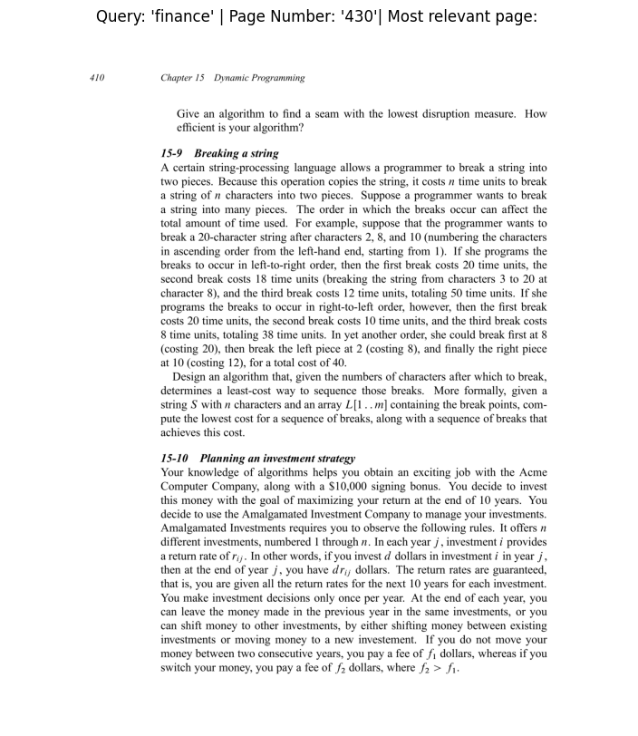

```python
%pip install requests
```

    huggingface/tokenizers: The current process just got forked, after parallelism has already been used. Disabling parallelism to avoid deadlocks...
    To disable this warning, you can either:
    	- Avoid using `tokenizers` before the fork if possible
    	- Explicitly set the environment variable TOKENIZERS_PARALLELISM=(true | false)


    Requirement already satisfied: requests in /Library/Frameworks/Python.framework/Versions/3.11/lib/python3.11/site-packages (2.32.5)
    Requirement already satisfied: charset_normalizer<4,>=2 in /Library/Frameworks/Python.framework/Versions/3.11/lib/python3.11/site-packages (from requests) (3.4.3)
    Requirement already satisfied: idna<4,>=2.5 in /Library/Frameworks/Python.framework/Versions/3.11/lib/python3.11/site-packages (from requests) (3.10)
    Requirement already satisfied: urllib3<3,>=1.21.1 in /Library/Frameworks/Python.framework/Versions/3.11/lib/python3.11/site-packages (from requests) (2.5.0)
    Requirement already satisfied: certifi>=2017.4.17 in /Library/Frameworks/Python.framework/Versions/3.11/lib/python3.11/site-packages (from requests) (2025.8.3)
    Note: you may need to restart the kernel to use updated packages.


```python
import os
import requests

#Get the pdf document path
pdf_path = "intro-to-algorithms.pdf"
filename = pdf_path

 #Download the pdf file from the url
if not os.path.exists(pdf_path):
    print(f"[INFO] File does not exist, downloading...")
    
    url = "https://www.cs.mcgill.ca/~akroit/math/compsci/Cormen%20Introduction%20to%20Algorithms.pdf"
    
    response = requests.get(url)
    
    if response.status_code == 200:
        #Open the file and save it
        with open(filename, "wb") as file:
            file.write(response.content)
            
        print(f"[INFO] The file has been downloaded and saved successfully as {filename}")
        
    else:
        print(f"[ERROR] Failed to download the file. Status Code: {response.status_code}")
else:
    print(f"[INFO] The file already exists: {filename}")


```

    [INFO] The file already exists: intro-to-algorithms.pdf


We now need to open the PDF


```python
%pip install PyMuPDF 
%pip install tqdm
%pip install re
```

    huggingface/tokenizers: The current process just got forked, after parallelism has already been used. Disabling parallelism to avoid deadlocks...
    To disable this warning, you can either:
    	- Avoid using `tokenizers` before the fork if possible
    	- Explicitly set the environment variable TOKENIZERS_PARALLELISM=(true | false)


    Requirement already satisfied: PyMuPDF in /Library/Frameworks/Python.framework/Versions/3.11/lib/python3.11/site-packages (1.26.4)
    Note: you may need to restart the kernel to use updated packages.


    huggingface/tokenizers: The current process just got forked, after parallelism has already been used. Disabling parallelism to avoid deadlocks...
    To disable this warning, you can either:
    	- Avoid using `tokenizers` before the fork if possible
    	- Explicitly set the environment variable TOKENIZERS_PARALLELISM=(true | false)


    Requirement already satisfied: tqdm in /Library/Frameworks/Python.framework/Versions/3.11/lib/python3.11/site-packages (4.67.1)
    Note: you may need to restart the kernel to use updated packages.


    huggingface/tokenizers: The current process just got forked, after parallelism has already been used. Disabling parallelism to avoid deadlocks...
    To disable this warning, you can either:
    	- Avoid using `tokenizers` before the fork if possible
    	- Explicitly set the environment variable TOKENIZERS_PARALLELISM=(true | false)


    ERROR: Could not find a version that satisfies the requirement re (from versions: none)
    ERROR: No matching distribution found for re
    Note: you may need to restart the kernel to use updated packages.


```python
import fitz
from tqdm.auto import tqdm

def text_formatter(text: str) -> str:
    """ Performs minor formatting on text """
    text = text.replace("\n", " ")
    return text.strip()

def open_and_read_pdf(pdf_path: str) -> list[dict]:
    """ Extracts text from a PDF file and reads its contents """
    doc = fitz.open(pdf_path)
    pages_and_text = []
    for page_number, page in tqdm(enumerate(doc)):
        text = page.get_text()
        text = text_formatter(text=text)
        pages_and_text.append({
            "page_number": page_number - 20,
            "page_char_count": len(text),
            "page_word_count": len(text.split(" ")),
            "page_sentence_count": len(text.split('.')),
            "page_token_count": len(text) / 4, #1 token = ~ 4 characters
            "text": text
        })
    return pages_and_text

pages_and_texts = open_and_read_pdf(pdf_path=pdf_path)
pages_and_texts[:2]
    
    
    
```

    706it [00:01, 557.00it/s]


    ---------------------------------------------------------------------------

    KeyboardInterrupt                         Traceback (most recent call last)

    Cell In[92], line 26
         16         pages_and_text.append({
         17             "page_number": page_number - 20,
         18             "page_char_count": len(text),
       (...)     22             "text": text
         23         })
         24     return pages_and_text
    ---> 26 pages_and_texts = open_and_read_pdf(pdf_path=pdf_path)
         27 pages_and_texts[:2]


    Cell In[92], line 14, in open_and_read_pdf(pdf_path)
         12 pages_and_text = []
         13 for page_number, page in tqdm(enumerate(doc)):
    ---> 14     text = page.get_text()
         15     text = text_formatter(text=text)
         16     pages_and_text.append({
         17         "page_number": page_number - 20,
         18         "page_char_count": len(text),
       (...)     22         "text": text
         23     })


    File /Library/Frameworks/Python.framework/Versions/3.11/lib/python3.11/site-packages/pymupdf/utils.py:1002, in get_text(page, option, clip, flags, textpage, sort, delimiters, tolerance)
       1000     t = tp.extractXHTML()
       1001 else:
    -> 1002     t = tp.extractText(sort=sort)
       1004 if textpage is None:
       1005     del tp


    File /Library/Frameworks/Python.framework/Versions/3.11/lib/python3.11/site-packages/pymupdf/__init__.py:12275, in TextPage.extractText(self, sort)
      12273 """Return simple, bare text on the page."""
      12274 if not sort:
    > 12275     return self._extractText(0)
      12276 blocks = self.extractBLOCKS()[:]
      12277 blocks.sort(key=lambda b: (b[3], b[0]))


    File /Library/Frameworks/Python.framework/Versions/3.11/lib/python3.11/site-packages/pymupdf/__init__.py:12079, in TextPage._extractText(self, format_)
      12077     mupdf.fz_print_stext_page_as_xhtml(out, this_tpage, 0)
      12078 else:
    > 12079     JM_print_stext_page_as_text(res, this_tpage)
      12080 out.fz_close_output()
      12081 text = JM_EscapeStrFromBuffer(res)


    File /Library/Frameworks/Python.framework/Versions/3.11/lib/python3.11/site-packages/pymupdf/__init__.py:16578, in JM_print_stext_page_as_text(res, page)
      16572 '''
      16573 Plain text output. An identical copy of fz_print_stext_page_as_text,
      16574 but lines within a block are concatenated by space instead a new-line
      16575 character (which else leads to 2 new-lines).
      16576 '''
      16577 if 1 and g_use_extra:
    > 16578     return extra.JM_print_stext_page_as_text(res, page)
      16580 assert isinstance(res, mupdf.FzBuffer)
      16581 assert isinstance(page, mupdf.FzStextPage)


    File /Library/Frameworks/Python.framework/Versions/3.11/lib/python3.11/site-packages/pymupdf/extra.py:165, in JM_print_stext_page_as_text(res, page)
        164 def JM_print_stext_page_as_text(res, page):
    --> 165     return _extra.JM_print_stext_page_as_text(res, page)


    KeyboardInterrupt: 


```python
import random

random.sample(pages_and_texts, k=3)
```


    [{'page_number': 1227,
      'page_char_count': 1360,
      'page_word_count': 305,
      'page_sentence_count': 24,
      'page_token_count': 340.0,
      'text': 'Problems for Appendix D 1227 is det.V.x0; x1; : : : ; xn\x001// D Y 0\x14j <k\x14n\x001 .xk \x00 xj/ : (Hint: Multiply column i by \x00x0 and add it to column i C 1 for i D n \x00 1; n \x00 2; : : : ; 1, and then use induction.) D-2 Permutations defined by matrix-vector multiplication over GF.2/ One class of permutations of the integers in the set Sn D f0; 1; 2; : : : ; 2n \x00 1g is defined by matrix multiplication over GF.2/. For each integer x in Sn, we view its binary representation as an n-bit vector \x00x0 x1 x2 ::: xn\x001 \x01 ; where x D Pn\x001 iD0 xi2i. If A is an n \x02 n matrix in which each entry is either 0 or 1, then we can define a permutation mapping each value x in Sn to the number whose binary representation is the matrix-vector product Ax. Here, we perform all arithmetic over GF.2/: all values are either 0 or 1, and with one exception the usual rules of addition and multiplication apply. The exception is that 1 C 1 D 0. You can think of arithmetic over GF.2/ as being just like regular integer arithmetic, except that you use only the least significant bit. As an example, for S2 D f0; 1; 2; 3g, the matrix A D \x12 1 0 1 1 \x13 defines the following permutation \x19A: \x19A.0/ D 0, \x19A.1/ D 3, \x19A.2/ D 2, \x19A.3/ D 1. To see why \x19A.3/ D 1, observe that, working in GF.2/, \x19A.3/ D \x12 1 0 1 1 \x13\x12 1 1 \x13 D \x12 1 \x01 1 C 0 \x01 1 1 \x01 1 C 1 \x01 1 \x13 D \x12 1 0 \x13 ; which is the binary representation of 1.'},
     {'page_number': 393,
      'page_char_count': 2457,
      'page_word_count': 486,
      'page_sentence_count': 27,
      'page_token_count': 614.25,
      'text': '15.4 Longest common subsequence 393 sive solution also has the overlapping-subproblems property, as we shall see in a moment. Step 2: A recursive solution Theorem 15.1 implies that we should examine either one or two subproblems when finding an LCS of X D hx1; x2; : : : ; xmi and Y D hy1; y2; : : : ; yni. If xm D yn, we must find an LCS of Xm\x001 and Yn\x001. Appending xm D yn to this LCS yields an LCS of X and Y . If xm ¤ yn, then we must solve two subproblems: finding an LCS of Xm\x001 and Y and finding an LCS of X and Yn\x001. Whichever of these two LCSs is longer is an LCS of X and Y . Because these cases exhaust all possibilities, we know that one of the optimal subproblem solutions must appear within an LCS of X and Y . We can readily see the overlapping-subproblems property in the LCS problem. To find an LCS of X and Y , we may need to find the LCSs of X and Yn\x001 and of Xm\x001 and Y . But each of these subproblems has the subsubproblem of finding an LCS of Xm\x001 and Yn\x001. Many other subproblems share subsubproblems. As in the matrix-chain multiplication problem, our recursive solution to the LCS problem involves establishing a recurrence for the value of an optimal solution. Let us define cŒi; j \x8d to be the length of an LCS of the sequences Xi and Yj. If either i D 0 or j D 0, one of the sequences has length 0, and so the LCS has length 0. The optimal substructure of the LCS problem gives the recursive formula cŒi; j \x8d D \x80 0 if i D 0 or j D 0 ; cŒi \x00 1; j \x00 1\x8d C 1 if i; j > 0 and xi D yj ; max.cŒi; j \x00 1\x8d; cŒi \x00 1; j \x8d/ if i; j > 0 and xi ¤ yj : (15.9) Observe that in this recursive formulation, a condition in the problem restricts which subproblems we may consider. When xi D yj, we can and should consider the subproblem of finding an LCS of Xi\x001 and Yj\x001. Otherwise, we instead con- sider the two subproblems of finding an LCS of Xi and Yj\x001 and of Xi\x001 and Yj. In the previous dynamic-programming algorithms we have examined—for rod cutting and matrix-chain multiplication—we ruled out no subproblems due to conditions in the problem. Finding an LCS is not the only dynamic-programming algorithm that rules out subproblems based on conditions in the problem. For example, the edit-distance problem (see Problem 15-5) has this characteristic. Step 3: Computing the length of an LCS Based on equation (15.9), we could easily write an exponential-time recursive al- gorithm to compute the length of an LCS of two sequences. Since the LCS problem'},
     {'page_number': 538,
      'page_char_count': 2000,
      'page_word_count': 363,
      'page_sentence_count': 34,
      'page_token_count': 500.0,
      'text': '538 Chapter 20 van Emde Boas Trees … 0 1 2 3 pu \x00 1 proto-\x17EB.u/ u summary cluster proto-\x17EB.pu/ structure pu proto-\x17EB.pu/ structures Figure 20.3 The information in a proto-\x17EB.u/ structure when u \x15 4. The structure contains the universe size u, a pointer summary to a proto-\x17EB.pu/ structure, and an array clusterŒ0 : : pu \x00 1\x8d of pu pointers to proto-\x17EB.pu/ structures. always be the universe size of the data structure in which we call the function, which changes as we descend into the recursive structure. 20.2.1 Proto van Emde Boas structures Taking our cue from recurrence (20.2), let us design a recursive data structure to support the operations. Although this data structure will fail to achieve our goal of O.lg lg u/ time for some operations, it serves as a basis for the van Emde Boas tree structure that we will see in Section 20.3. For the universe f0; 1; 2; : : : ; u \x00 1g, we define a proto van Emde Boas struc- ture, or proto-vEB structure, which we denote as proto-\x17EB.u/, recursively as follows. Each proto-\x17EB.u/ structure contains an attribute u giving its universe size. In addition, it contains the following: \x0f If u D 2, then it is the base size, and it contains an array AŒ0 : : 1\x8d of two bits. \x0f Otherwise, u D 22k for some integer k \x15 1, so that u \x15 4. In addition to the universe size u, the data structure proto-\x17EB.u/ contains the following attributes, illustrated in Figure 20.3: \x0f a pointer named summary to a proto-\x17EB.pu/ structure and \x0f an array clusterŒ0 : : pu\x001\x8d of pu pointers, each to a proto-\x17EB.pu/ struc- ture. The element x, where 0 \x14 x < u, is recursively stored in the cluster numbered high.x/ as element low.x/ within that cluster. In the two-level structure of the previous section, each node stores a summary array of size pu, in which each entry contains a bit. From the index of each entry, we can compute the starting index of the subarray of size pu that the bit summarizes. In the proto-vEB structure, we use explicit pointers rather than index'}]


```python
%pip install pandas
```

    Requirement already satisfied: pandas in /Library/Frameworks/Python.framework/Versions/3.11/lib/python3.11/site-packages (2.3.2)
    Requirement already satisfied: numpy>=1.23.2 in /Library/Frameworks/Python.framework/Versions/3.11/lib/python3.11/site-packages (from pandas) (2.3.2)
    Requirement already satisfied: python-dateutil>=2.8.2 in /Users/aayush/Library/Python/3.11/lib/python/site-packages (from pandas) (2.9.0.post0)
    Requirement already satisfied: pytz>=2020.1 in /Library/Frameworks/Python.framework/Versions/3.11/lib/python3.11/site-packages (from pandas) (2025.2)
    Requirement already satisfied: tzdata>=2022.7 in /Library/Frameworks/Python.framework/Versions/3.11/lib/python3.11/site-packages (from pandas) (2025.2)
    Requirement already satisfied: six>=1.5 in /Users/aayush/Library/Python/3.11/lib/python/site-packages (from python-dateutil>=2.8.2->pandas) (1.17.0)
    Note: you may need to restart the kernel to use updated packages.


```python
import pandas as pd

df = pd.DataFrame(pages_and_text)
df.head()

```


    ---------------------------------------------------------------------------

    NameError                                 Traceback (most recent call last)

    Cell In[14], line 3
          1 import pandas as pd
    ----> 3 df = pd.DataFrame(pages_and_text)
          4 df.head()


    NameError: name 'pages_and_text' is not defined


```python
df.describe().round(2)
```


<div>
<style scoped>
    .dataframe tbody tr th:only-of-type {
        vertical-align: middle;
    }

    .dataframe tbody tr th {
        vertical-align: top;
    }

    .dataframe thead th {
        text-align: right;
    }
</style>
<table border="1" class="dataframe">
  <thead>
    <tr style="text-align: right;">
      <th></th>
      <th>page_number</th>
      <th>page_char_count</th>
      <th>page_word_count</th>
      <th>page_sentence_count</th>
      <th>page_token_count</th>
    </tr>
  </thead>
  <tbody>
    <tr>
      <th>count</th>
      <td>1313.00</td>
      <td>1313.00</td>
      <td>1313.00</td>
      <td>1313.0</td>
      <td>1313.00</td>
    </tr>
    <tr>
      <th>mean</th>
      <td>636.00</td>
      <td>1935.34</td>
      <td>365.27</td>
      <td>1.0</td>
      <td>483.83</td>
    </tr>
    <tr>
      <th>std</th>
      <td>379.17</td>
      <td>577.43</td>
      <td>101.17</td>
      <td>0.0</td>
      <td>144.36</td>
    </tr>
    <tr>
      <th>min</th>
      <td>-20.00</td>
      <td>0.00</td>
      <td>1.00</td>
      <td>1.0</td>
      <td>0.00</td>
    </tr>
    <tr>
      <th>25%</th>
      <td>308.00</td>
      <td>1603.00</td>
      <td>310.00</td>
      <td>1.0</td>
      <td>400.75</td>
    </tr>
    <tr>
      <th>50%</th>
      <td>636.00</td>
      <td>1974.00</td>
      <td>370.00</td>
      <td>1.0</td>
      <td>493.50</td>
    </tr>
    <tr>
      <th>75%</th>
      <td>964.00</td>
      <td>2334.00</td>
      <td>434.00</td>
      <td>1.0</td>
      <td>583.50</td>
    </tr>
    <tr>
      <th>max</th>
      <td>1292.00</td>
      <td>3275.00</td>
      <td>639.00</td>
      <td>1.0</td>
      <td>818.75</td>
    </tr>
  </tbody>
</table>
</div>


Why would we care about token count? 

Token count is important to think about because: 
1. Embedding models don't deal with infinite tokens.
2. LLMs don't deal with infinite tokens.

For example, an embedding model may have been trained to embed sequences of 384 tokens into numerical space (sentence transformers `all-mpnet-base-v2`, see: https://www.sbert.net/docs/pretrained_models.html).

As for LLMs, they can't accept infinite tokens in their context window. 

### Further text processing (Splitting pages into sentences)

Two ways to do this: 
1. We've done this by splitting on `"."`. 
2. We can do this with an NLP library such as [spaCy](https://spacy.io/usage) and [nltk](https://nltk.org/).

Note to Self: spacy was downloaded and not added into the Notebook. Should be installed based on the instructions provided in spacy.io.


```python
from spacy.lang.en import English

nlp = English()

#Add a sentencizer pipeline, see https://spacy.io/api/sentencizer
nlp.add_pipe("sentencizer")

#Create document instance as an example
doc = nlp("This is a sentence. This is another sentence. I like Elephants.")
assert len(list(doc.sents)) == 3

# Print out our sentences split
list(doc.sents)
```


    [This is a sentence., This is another sentence., I like Elephants.]


```python
for item in tqdm(pages_and_texts): 
    item["sentences"] = list(nlp(item["text"]).sents) # Group text into sentences and add to pages and texts
    
    # Make sure all sentences are strings (the default type is a spaCy datatype)
    item["sentences"] = [str(sentence) for sentence in item["sentences"]]
    
    # Count the sentences 
    item["page_sentence_count_spacy"] = len(item["sentences"])
```

    100%|██████████| 1313/1313 [00:01<00:00, 1143.01it/s]


```python
df = pd.DataFrame(pages_and_texts)
df.describe().round(2)
```


<div>
<style scoped>
    .dataframe tbody tr th:only-of-type {
        vertical-align: middle;
    }

    .dataframe tbody tr th {
        vertical-align: top;
    }

    .dataframe thead th {
        text-align: right;
    }
</style>
<table border="1" class="dataframe">
  <thead>
    <tr style="text-align: right;">
      <th></th>
      <th>page_number</th>
      <th>page_char_count</th>
      <th>page_word_count</th>
      <th>page_sentence_count</th>
      <th>page_token_count</th>
      <th>page_sentence_count_spacy</th>
    </tr>
  </thead>
  <tbody>
    <tr>
      <th>count</th>
      <td>1313.00</td>
      <td>1313.00</td>
      <td>1313.00</td>
      <td>1313.00</td>
      <td>1313.00</td>
      <td>1313.00</td>
    </tr>
    <tr>
      <th>mean</th>
      <td>636.00</td>
      <td>1935.34</td>
      <td>365.27</td>
      <td>30.08</td>
      <td>483.83</td>
      <td>14.71</td>
    </tr>
    <tr>
      <th>std</th>
      <td>379.17</td>
      <td>577.43</td>
      <td>101.17</td>
      <td>13.90</td>
      <td>144.36</td>
      <td>8.01</td>
    </tr>
    <tr>
      <th>min</th>
      <td>-20.00</td>
      <td>0.00</td>
      <td>1.00</td>
      <td>1.00</td>
      <td>0.00</td>
      <td>0.00</td>
    </tr>
    <tr>
      <th>25%</th>
      <td>308.00</td>
      <td>1603.00</td>
      <td>310.00</td>
      <td>22.00</td>
      <td>400.75</td>
      <td>10.00</td>
    </tr>
    <tr>
      <th>50%</th>
      <td>636.00</td>
      <td>1974.00</td>
      <td>370.00</td>
      <td>28.00</td>
      <td>493.50</td>
      <td>14.00</td>
    </tr>
    <tr>
      <th>75%</th>
      <td>964.00</td>
      <td>2334.00</td>
      <td>434.00</td>
      <td>35.00</td>
      <td>583.50</td>
      <td>18.00</td>
    </tr>
    <tr>
      <th>max</th>
      <td>1292.00</td>
      <td>3275.00</td>
      <td>639.00</td>
      <td>111.00</td>
      <td>818.75</td>
      <td>68.00</td>
    </tr>
  </tbody>
</table>
</div>


### Chunking our sentences together

The concept of splitting larger pieces of text into smaller ones is often referred to as text splitting or chunking. 

There is no 100% correct way of doing this. 

To keep it simple, we will split into groups of 10 sentences (however, can also try with 5, 7 or 8, whatever works).

There are frameworks such as [LangChain](https://python.langchain.com/docs/concepts/text_splitters/) that can help with this, but we will stick for Python for this tutorial.

Why we do this:
1. So our texts are easier to filter (smaller groups of text can be easier to inspect than larger passages of text)
2. So our text chunks can fit into our embedding model context window
3. So our contexts passed to an LLM can be more specific and focused.  


```python
# Define split size to turn groups of sentences into chunks
num_sentence_chunk_size = 10

# Create a function to split lists of texts recursively into chunk size
# e.g. [20] -> [10, 10], [25] -> [10, 10, 5]
def split_list(input_list: list, 
               slice_size: int=num_sentence_chunk_size) -> list[list[str]]:
    return [input_list[i:i+slice_size] for i in range(0, len(input_list), slice_size)]
test_list = list(range(25))
split_list(test_list) 

```


    [[0, 1, 2, 3, 4, 5, 6, 7, 8, 9],
     [10, 11, 12, 13, 14, 15, 16, 17, 18, 19],
     [20, 21, 22, 23, 24]]


```python
# Loop through pages and texts and split sentences into chunks
for item in tqdm(pages_and_texts):
    item["sentence_chunks"] = split_list(input_list=item["sentences"],
                                         slice_size=num_sentence_chunk_size)
    item["num_chunks"] = len(item["sentence_chunks"]) 
    
```

    100%|██████████| 1313/1313 [00:00<00:00, 548736.66it/s]


```python
random.sample(pages_and_texts, k=1)
```


    [{'page_number': 667,
      'page_char_count': 1771,
      'page_word_count': 329,
      'page_sentence_count': 46,
      'page_token_count': 442.75,
      'text': '24.4 Difference constraints and shortest paths 667 0 0 0 0 0 0 –1 1 5 4 –1 –3 –3 0 –5 –3 0 –1 –4 v3 v2 v1 v5 v0 v4 Figure 24.8 The constraint graph corresponding to the system (24.3)–(24.10) of difference con- straints. The value of ı.\x170; \x17i/ appears in each vertex \x17i. One feasible solution to the system is x D .\x005; \x003; 0; \x001; \x004/. The constraint graph contains the additional vertex \x170, as we shall see shortly, to guarantee that the graph has some vertex which can reach all other vertices. Thus, the vertex set V consists of a vertex \x17i for each unknown xi, plus an additional vertex \x170. The edge set E contains an edge for each difference constraint, plus an edge .\x170; \x17i/ for each unknown xi. If xj \x00 xi \x14 bk is a difference constraint, then the weight of edge .\x17i; \x17j/ is w.\x17i; \x17j/ D bk. The weight of each edge leav- ing \x170 is 0. Figure 24.8 shows the constraint graph for the system (24.3)–(24.10) of difference constraints. The following theorem shows that we can find a solution to a system of differ- ence constraints by finding shortest-path weights in the corresponding constraint graph. Theorem 24.9 Given a system Ax \x14 b of difference constraints, let G D .V; E/ be the corre- sponding constraint graph. If G contains no negative-weight cycles, then x D .ı.\x170; \x171/; ı.\x170; \x172/; ı.\x170; \x173/; : : : ; ı.\x170; \x17n// (24.11) is a feasible solution for the system. If G contains a negative-weight cycle, then there is no feasible solution for the system. Proof We first show that if the constraint graph contains no negative-weight cycles, then equation (24.11) gives a feasible solution. Consider any edge .\x17i; \x17j/ 2 E. By the triangle inequality, ı.\x170; \x17j/ \x14 ı.\x170; \x17i/ C w.\x17i; \x17j/ or, equivalently, ı.\x170; \x17j/ \x00 ı.\x170; \x17i/ \x14 w.\x17i; \x17j/. Thus, letting xi D ı.\x170; \x17i/ and',
      'sentences': ['24.4 Difference constraints and shortest paths 667 0 0 0 0 0 0 –1 1 5 4 –1 –3 –3 0 –5 –3 0 –1 –4 v3 v2 v1 v5 v0 v4 Figure 24.8 The constraint graph corresponding to the system (24.3)–(24.10) of difference con- straints.',
       'The value of ı.\x170; \x17i/ appears in each vertex \x17i.',
       'One feasible solution to the system is x D .\x005; \x003; 0; \x001; \x004/. The constraint graph contains the additional vertex \x170, as we shall see shortly, to guarantee that the graph has some vertex which can reach all other vertices.',
       'Thus, the vertex set V consists of a vertex \x17i for each unknown xi, plus an additional vertex \x170.',
       'The edge set E contains an edge for each difference constraint, plus an edge .\x170; \x17i/ for each unknown xi.',
       'If xj \x00 xi \x14 bk is a difference constraint, then the weight of edge .\x17i; \x17j/ is w.\x17i; \x17j/ D bk.',
       'The weight of each edge leav- ing \x170 is 0.',
       'Figure 24.8 shows the constraint graph for the system (24.3)–(24.10) of difference constraints.',
       'The following theorem shows that we can find a solution to a system of differ- ence constraints by finding shortest-path weights in the corresponding constraint graph.',
       'Theorem 24.9 Given a system Ax \x14 b of difference constraints, let G D .V; E/ be the corre- sponding constraint graph.',
       'If G contains no negative-weight cycles, then x D .ı.\x170; \x171/; ı.\x170; \x172/; ı.\x170; \x173/; : : : ; ı.\x170; \x17n// (24.11) is a feasible solution for the system.',
       'If G contains a negative-weight cycle, then there is no feasible solution for the system.',
       'Proof We first show that if the constraint graph contains no negative-weight cycles, then equation (24.11) gives a feasible solution.',
       'Consider any edge .\x17i; \x17j/ 2 E. By the triangle inequality, ı.\x170; \x17j/ \x14 ı.\x170; \x17i/ C w.\x17i; \x17j/ or, equivalently, ı.\x170; \x17j/ \x00 ı.\x170; \x17i/ \x14 w.\x17i; \x17j/. Thus, letting xi D ı.\x170; \x17i/ and'],
      'page_sentence_count_spacy': 14,
      'sentence_chunks': [['24.4 Difference constraints and shortest paths 667 0 0 0 0 0 0 –1 1 5 4 –1 –3 –3 0 –5 –3 0 –1 –4 v3 v2 v1 v5 v0 v4 Figure 24.8 The constraint graph corresponding to the system (24.3)–(24.10) of difference con- straints.',
        'The value of ı.\x170; \x17i/ appears in each vertex \x17i.',
        'One feasible solution to the system is x D .\x005; \x003; 0; \x001; \x004/. The constraint graph contains the additional vertex \x170, as we shall see shortly, to guarantee that the graph has some vertex which can reach all other vertices.',
        'Thus, the vertex set V consists of a vertex \x17i for each unknown xi, plus an additional vertex \x170.',
        'The edge set E contains an edge for each difference constraint, plus an edge .\x170; \x17i/ for each unknown xi.',
        'If xj \x00 xi \x14 bk is a difference constraint, then the weight of edge .\x17i; \x17j/ is w.\x17i; \x17j/ D bk.',
        'The weight of each edge leav- ing \x170 is 0.',
        'Figure 24.8 shows the constraint graph for the system (24.3)–(24.10) of difference constraints.',
        'The following theorem shows that we can find a solution to a system of differ- ence constraints by finding shortest-path weights in the corresponding constraint graph.',
        'Theorem 24.9 Given a system Ax \x14 b of difference constraints, let G D .V; E/ be the corre- sponding constraint graph.'],
       ['If G contains no negative-weight cycles, then x D .ı.\x170; \x171/; ı.\x170; \x172/; ı.\x170; \x173/; : : : ; ı.\x170; \x17n// (24.11) is a feasible solution for the system.',
        'If G contains a negative-weight cycle, then there is no feasible solution for the system.',
        'Proof We first show that if the constraint graph contains no negative-weight cycles, then equation (24.11) gives a feasible solution.',
        'Consider any edge .\x17i; \x17j/ 2 E. By the triangle inequality, ı.\x170; \x17j/ \x14 ı.\x170; \x17i/ C w.\x17i; \x17j/ or, equivalently, ı.\x170; \x17j/ \x00 ı.\x170; \x17i/ \x14 w.\x17i; \x17j/. Thus, letting xi D ı.\x170; \x17i/ and']],
      'num_chunks': 2}]


```python
df = pd.DataFrame(pages_and_texts)
df.describe().round(2)
```


<div>
<style scoped>
    .dataframe tbody tr th:only-of-type {
        vertical-align: middle;
    }

    .dataframe tbody tr th {
        vertical-align: top;
    }

    .dataframe thead th {
        text-align: right;
    }
</style>
<table border="1" class="dataframe">
  <thead>
    <tr style="text-align: right;">
      <th></th>
      <th>page_number</th>
      <th>page_char_count</th>
      <th>page_word_count</th>
      <th>page_sentence_count</th>
      <th>page_token_count</th>
      <th>page_sentence_count_spacy</th>
      <th>num_chunks</th>
    </tr>
  </thead>
  <tbody>
    <tr>
      <th>count</th>
      <td>1313.00</td>
      <td>1313.00</td>
      <td>1313.00</td>
      <td>1313.00</td>
      <td>1313.00</td>
      <td>1313.00</td>
      <td>1313.00</td>
    </tr>
    <tr>
      <th>mean</th>
      <td>636.00</td>
      <td>1935.34</td>
      <td>365.27</td>
      <td>30.08</td>
      <td>483.83</td>
      <td>14.71</td>
      <td>1.92</td>
    </tr>
    <tr>
      <th>std</th>
      <td>379.17</td>
      <td>577.43</td>
      <td>101.17</td>
      <td>13.90</td>
      <td>144.36</td>
      <td>8.01</td>
      <td>0.84</td>
    </tr>
    <tr>
      <th>min</th>
      <td>-20.00</td>
      <td>0.00</td>
      <td>1.00</td>
      <td>1.00</td>
      <td>0.00</td>
      <td>0.00</td>
      <td>0.00</td>
    </tr>
    <tr>
      <th>25%</th>
      <td>308.00</td>
      <td>1603.00</td>
      <td>310.00</td>
      <td>22.00</td>
      <td>400.75</td>
      <td>10.00</td>
      <td>1.00</td>
    </tr>
    <tr>
      <th>50%</th>
      <td>636.00</td>
      <td>1974.00</td>
      <td>370.00</td>
      <td>28.00</td>
      <td>493.50</td>
      <td>14.00</td>
      <td>2.00</td>
    </tr>
    <tr>
      <th>75%</th>
      <td>964.00</td>
      <td>2334.00</td>
      <td>434.00</td>
      <td>35.00</td>
      <td>583.50</td>
      <td>18.00</td>
      <td>2.00</td>
    </tr>
    <tr>
      <th>max</th>
      <td>1292.00</td>
      <td>3275.00</td>
      <td>639.00</td>
      <td>111.00</td>
      <td>818.75</td>
      <td>68.00</td>
      <td>7.00</td>
    </tr>
  </tbody>
</table>
</div>


### Splitting each chunk into its own item

We'd like to embed each chunk of sentences into its own numerical representation. 

That'll give us a good level of granularity.

Meaning, we can dive specifically into the text sample that was used in our model.


```python
import re

# Split each chunk into its own item
pages_and_chunks = []
for item in tqdm(pages_and_texts):
    for sentence_chunk in item["sentence_chunks"]:
        chunk_dict = {}
        chunk_dict["page_number"] = item["page_number"]
        
        # Join the sentences into a paragraph like structure, aka join the list of sentences into one paragraph
        joined_sentence_chunk = "".join(sentence_chunk).replace("  ", " ").strip()
        joined_sentence_chunk = re.sub(r'\.([A-Z])', r'. \1', joined_sentence_chunk)
        
        chunk_dict["sentence_chunk"] = joined_sentence_chunk
        
        # Get some stats on our chunks
        chunk_dict["chunk_char_count"] = len(joined_sentence_chunk)
        chunk_dict["chunk_word_count"] = len([word for word in joined_sentence_chunk.split(" ")])
        chunk_dict["chunk_token_count"] = len(joined_sentence_chunk) / 4 # 1 token = ~ 4 chars
        
        pages_and_chunks.append(chunk_dict)

len(pages_and_chunks)
        
        
```

    100%|██████████| 1313/1313 [00:00<00:00, 32985.07it/s]


    2517


```python
random.sample(pages_and_chunks, k = 1)
```


    [{'page_number': 876,
      'sentence_chunk': '876 Chapter 29 Linear Programming Lemma 29.3 Let I be a set of indices. For each j 2 I, let ˛j and ˇj be real numbers, and let xj be a real-valued variable. Let be any real number. Suppose that for any settings of the xj, we have X j2I ˛jxj D C X j2I ˇjxj : (29.78) Then ˛j D ˇj for each j 2 I, and D 0. Proof Since equation (29.78) holds for any values of the xj, we can use particular values to draw conclusions about ˛, ˇ, and . If we let xj D 0 for each j 2 I, we conclude that D 0. Now pick an arbitrary index j 2 I, and set xj D 1 and xk D 0 for all k ¤ j . Then we must have ˛j D ˇj. Since we picked j as any index in I, we conclude that ˛j D ˇj for each j 2 I. A particular linear program has many different slack forms; recall that each slack form has the same set of feasible and optimal solutions as the original linear pro- gram. We now show that the slack form of a linear program is uniquely determined by the set of basic variables.',
      'chunk_char_count': 947,
      'chunk_word_count': 209,
      'chunk_token_count': 236.75}]


```python
df = pd.DataFrame(pages_and_chunks)
df.describe().round(2)
```


<div>
<style scoped>
    .dataframe tbody tr th:only-of-type {
        vertical-align: middle;
    }

    .dataframe tbody tr th {
        vertical-align: top;
    }

    .dataframe thead th {
        text-align: right;
    }
</style>
<table border="1" class="dataframe">
  <thead>
    <tr style="text-align: right;">
      <th></th>
      <th>page_number</th>
      <th>chunk_char_count</th>
      <th>chunk_word_count</th>
      <th>chunk_token_count</th>
    </tr>
  </thead>
  <tbody>
    <tr>
      <th>count</th>
      <td>2517.00</td>
      <td>2517.00</td>
      <td>2517.00</td>
      <td>2517.00</td>
    </tr>
    <tr>
      <th>mean</th>
      <td>669.58</td>
      <td>1008.50</td>
      <td>189.95</td>
      <td>252.12</td>
    </tr>
    <tr>
      <th>std</th>
      <td>390.17</td>
      <td>515.08</td>
      <td>105.23</td>
      <td>128.77</td>
    </tr>
    <tr>
      <th>min</th>
      <td>-20.00</td>
      <td>9.00</td>
      <td>2.00</td>
      <td>2.25</td>
    </tr>
    <tr>
      <th>25%</th>
      <td>340.00</td>
      <td>585.00</td>
      <td>100.00</td>
      <td>146.25</td>
    </tr>
    <tr>
      <th>50%</th>
      <td>668.00</td>
      <td>1046.00</td>
      <td>191.00</td>
      <td>261.50</td>
    </tr>
    <tr>
      <th>75%</th>
      <td>1018.00</td>
      <td>1381.00</td>
      <td>263.00</td>
      <td>345.25</td>
    </tr>
    <tr>
      <th>max</th>
      <td>1292.00</td>
      <td>2607.00</td>
      <td>548.00</td>
      <td>651.75</td>
    </tr>
  </tbody>
</table>
</div>


### Filter chunks of text for short chunks

These chunks may not contain much useful information.


```python
# Show random chunks with under 30 tokens in length
min_token_length = 30
for row in df[df["chunk_token_count"] <= min_token_length].sample(5).iterrows():
    print(f'Chunk Token Count: {row[1]["chunk_token_count"]} | Text: {row[1]["sentence_chunk"]}')
```

    Chunk Token Count: 14.0 | Text: The expected value of the random variable X representing
    Chunk Token Count: 8.25 | Text: The total time is thus O.n lg n/.
    Chunk Token Count: 11.75 | Text: 505 insertion into binary search trees, 294–295
    Chunk Token Count: 6.5 | Text: V Advanced Data Structures
    Chunk Token Count: 4.5 | Text: The relation <x is


```python
pages_and_chunks_over_min_token_len = df[df["chunk_token_count"] > min_token_length].to_dict(orient="records")
pages_and_chunks_over_min_token_len[:2]
```


    [{'page_number': -20,
      'sentence_chunk': 'A L G O R I T H M S I N T R O D U C T I O N T O T H I R D E D I T I O N T H O M A S H. C H A R L E S E.    R O N A L D L. C L I F F O R D S T E I N R I V E S T L E I S E R S O N C O R M E N',
      'chunk_char_count': 189,
      'chunk_word_count': 95,
      'chunk_token_count': 47.25},
     {'page_number': -17,
      'sentence_chunk': 'Thomas H. Cormen Charles E. Leiserson Ronald L. Rivest Clifford Stein Introduction to Algorithms Third Edition The MIT Press Cambridge, Massachusetts London, England',
      'chunk_char_count': 165,
      'chunk_word_count': 23,
      'chunk_token_count': 41.25}]


```python
random.sample(pages_and_chunks_over_min_token_len, k=1)
```


    [{'page_number': 236,
      'sentence_chunk': 'In a circular list, the pre\x17 pointer of the head of the list points to the tail, and the next pointer of the tail of the list points to the head. We can think of a circular list as a ring of',
      'chunk_char_count': 190,
      'chunk_word_count': 42,
      'chunk_token_count': 47.5}]


# Embedding Our Text Chunks

[Embeddings](https://vickiboykis.com/what_are_embeddings/) are a broad but powerful concept.

While humans understand text, machines understand numbers. 

What we'd like to do: 
- Turn our text chunks into numbers, specifically, embeddings. 

A useful numerical representation.

The best part about embeddings is that they are a *learned* representation.

```
{"the": 0,
"a": 1, 
...
...}
```


```python
%pip install -U sentence-transformers
from sentence_transformers import SentenceTransformer
embedding_model = SentenceTransformer(model_name_or_path="all-mpnet-base-v2",
                                      device="cpu")

# Create a list of sentences
sentences = ["Hello, my name is John and I like football.",
             "AI is so cool nowadays.",
             "Embeddings are a revolutionary technology",
             "I went to the farm the other day."]

embeddings = embedding_model.encode(sentences)
embeddings_dict = dict(zip(sentences, embeddings))

# See the embeddings
for sentence, embedding in embeddings_dict.items():
    print(f"Sentence: {sentence}")
    print(f"Embedding: {embedding}")
    print("")
```

    Requirement already satisfied: sentence-transformers in /Library/Frameworks/Python.framework/Versions/3.11/lib/python3.11/site-packages (5.1.0)
    Requirement already satisfied: transformers<5.0.0,>=4.41.0 in /Library/Frameworks/Python.framework/Versions/3.11/lib/python3.11/site-packages (from sentence-transformers) (4.56.1)
    Requirement already satisfied: tqdm in /Library/Frameworks/Python.framework/Versions/3.11/lib/python3.11/site-packages (from sentence-transformers) (4.67.1)
    Requirement already satisfied: torch>=1.11.0 in /Library/Frameworks/Python.framework/Versions/3.11/lib/python3.11/site-packages (from sentence-transformers) (2.8.0)
    Requirement already satisfied: scikit-learn in /Library/Frameworks/Python.framework/Versions/3.11/lib/python3.11/site-packages (from sentence-transformers) (1.7.1)
    Requirement already satisfied: scipy in /Library/Frameworks/Python.framework/Versions/3.11/lib/python3.11/site-packages (from sentence-transformers) (1.16.1)
    Requirement already satisfied: huggingface-hub>=0.20.0 in /Library/Frameworks/Python.framework/Versions/3.11/lib/python3.11/site-packages (from sentence-transformers) (0.34.4)
    Requirement already satisfied: Pillow in /Library/Frameworks/Python.framework/Versions/3.11/lib/python3.11/site-packages (from sentence-transformers) (11.3.0)
    Requirement already satisfied: typing_extensions>=4.5.0 in /Users/aayush/Library/Python/3.11/lib/python/site-packages (from sentence-transformers) (4.15.0)
    Requirement already satisfied: filelock in /Library/Frameworks/Python.framework/Versions/3.11/lib/python3.11/site-packages (from transformers<5.0.0,>=4.41.0->sentence-transformers) (3.19.1)
    Requirement already satisfied: numpy>=1.17 in /Library/Frameworks/Python.framework/Versions/3.11/lib/python3.11/site-packages (from transformers<5.0.0,>=4.41.0->sentence-transformers) (2.3.2)
    Requirement already satisfied: packaging>=20.0 in /Users/aayush/Library/Python/3.11/lib/python/site-packages (from transformers<5.0.0,>=4.41.0->sentence-transformers) (25.0)
    Requirement already satisfied: pyyaml>=5.1 in /Library/Frameworks/Python.framework/Versions/3.11/lib/python3.11/site-packages (from transformers<5.0.0,>=4.41.0->sentence-transformers) (6.0.2)
    Requirement already satisfied: regex!=2019.12.17 in /Library/Frameworks/Python.framework/Versions/3.11/lib/python3.11/site-packages (from transformers<5.0.0,>=4.41.0->sentence-transformers) (2025.9.1)
    Requirement already satisfied: requests in /Library/Frameworks/Python.framework/Versions/3.11/lib/python3.11/site-packages (from transformers<5.0.0,>=4.41.0->sentence-transformers) (2.32.5)
    Requirement already satisfied: tokenizers<=0.23.0,>=0.22.0 in /Library/Frameworks/Python.framework/Versions/3.11/lib/python3.11/site-packages (from transformers<5.0.0,>=4.41.0->sentence-transformers) (0.22.0)
    Requirement already satisfied: safetensors>=0.4.3 in /Library/Frameworks/Python.framework/Versions/3.11/lib/python3.11/site-packages (from transformers<5.0.0,>=4.41.0->sentence-transformers) (0.6.2)
    Requirement already satisfied: fsspec>=2023.5.0 in /Library/Frameworks/Python.framework/Versions/3.11/lib/python3.11/site-packages (from huggingface-hub>=0.20.0->sentence-transformers) (2025.9.0)
    Requirement already satisfied: hf-xet<2.0.0,>=1.1.3 in /Library/Frameworks/Python.framework/Versions/3.11/lib/python3.11/site-packages (from huggingface-hub>=0.20.0->sentence-transformers) (1.1.9)
    Requirement already satisfied: sympy>=1.13.3 in /Library/Frameworks/Python.framework/Versions/3.11/lib/python3.11/site-packages (from torch>=1.11.0->sentence-transformers) (1.14.0)
    Requirement already satisfied: networkx in /Library/Frameworks/Python.framework/Versions/3.11/lib/python3.11/site-packages (from torch>=1.11.0->sentence-transformers) (3.5)
    Requirement already satisfied: jinja2 in /Library/Frameworks/Python.framework/Versions/3.11/lib/python3.11/site-packages (from torch>=1.11.0->sentence-transformers) (3.1.6)
    Requirement already satisfied: mpmath<1.4,>=1.1.0 in /Library/Frameworks/Python.framework/Versions/3.11/lib/python3.11/site-packages (from sympy>=1.13.3->torch>=1.11.0->sentence-transformers) (1.3.0)
    Requirement already satisfied: MarkupSafe>=2.0 in /Library/Frameworks/Python.framework/Versions/3.11/lib/python3.11/site-packages (from jinja2->torch>=1.11.0->sentence-transformers) (3.0.2)
    Requirement already satisfied: charset_normalizer<4,>=2 in /Library/Frameworks/Python.framework/Versions/3.11/lib/python3.11/site-packages (from requests->transformers<5.0.0,>=4.41.0->sentence-transformers) (3.4.3)
    Requirement already satisfied: idna<4,>=2.5 in /Library/Frameworks/Python.framework/Versions/3.11/lib/python3.11/site-packages (from requests->transformers<5.0.0,>=4.41.0->sentence-transformers) (3.10)
    Requirement already satisfied: urllib3<3,>=1.21.1 in /Library/Frameworks/Python.framework/Versions/3.11/lib/python3.11/site-packages (from requests->transformers<5.0.0,>=4.41.0->sentence-transformers) (2.5.0)
    Requirement already satisfied: certifi>=2017.4.17 in /Library/Frameworks/Python.framework/Versions/3.11/lib/python3.11/site-packages (from requests->transformers<5.0.0,>=4.41.0->sentence-transformers) (2025.8.3)
    Requirement already satisfied: joblib>=1.2.0 in /Library/Frameworks/Python.framework/Versions/3.11/lib/python3.11/site-packages (from scikit-learn->sentence-transformers) (1.5.2)
    Requirement already satisfied: threadpoolctl>=3.1.0 in /Library/Frameworks/Python.framework/Versions/3.11/lib/python3.11/site-packages (from scikit-learn->sentence-transformers) (3.6.0)
    Note: you may need to restart the kernel to use updated packages.
    Sentence: Hello, my name is John and I like football.
    Embedding: [ 1.29194220e-03  7.20893592e-02 -1.17977790e-03 -2.62890253e-02
      3.96553315e-02 -4.10587005e-02 -5.22783026e-02  7.64403446e-03
     -1.27780419e-02 -1.90602019e-04  3.95361073e-02 -2.21871939e-02
      1.24161486e-02  1.51262730e-02  3.52668054e-02 -4.13680039e-02
      4.56340332e-03 -6.52403831e-02  6.32882938e-02 -7.24698836e-03
      4.18687873e-02  5.12758212e-04 -1.46308355e-02 -1.39766848e-02
     -5.79854287e-02  2.54586097e-02 -1.36849908e-02  4.45831427e-03
     -1.05274487e-02  7.11089149e-02 -9.09978990e-03 -3.25113684e-02
     -3.53915337e-03 -1.13454703e-02  1.58650278e-06  1.18198972e-02
     -1.19213499e-02 -2.13643741e-02  7.80989155e-02  2.57006002e-04
      1.19429715e-02 -3.15609947e-03 -1.37991933e-02 -3.18820425e-03
     -8.89387634e-03  6.08826894e-03  5.48814870e-02  6.89790631e-03
      1.10323401e-02  3.49150077e-02 -6.11934531e-03 -3.25804055e-02
     -9.72216111e-03 -1.93841681e-02  1.71074513e-02 -4.09588292e-02
      2.14565936e-02  3.89237329e-02 -4.63889055e-02  1.49406614e-02
      2.84018945e-02 -1.44127803e-02 -1.53793851e-02 -5.53088039e-02
      7.06852181e-03  4.02157828e-02 -4.77218516e-02  1.37788104e-02
      2.97512058e-02  7.86686409e-03 -2.79253051e-02 -3.83766368e-02
      1.42756281e-02  3.24692763e-02  2.02838555e-02 -2.53119543e-02
     -3.54170129e-02  2.72540785e-02 -9.90812667e-03 -2.24003959e-02
      4.05772310e-03 -1.21404156e-02  1.22093894e-02  9.32003837e-03
     -4.20229621e-02 -1.06263375e-02  1.50017440e-02 -9.50445421e-03
     -5.41299721e-03  3.21739353e-02 -8.90927613e-02 -3.22480351e-02
      2.61564795e-02  4.31284904e-02  1.68773830e-02 -4.75511774e-02
      4.61938995e-04 -3.42037678e-02 -2.67011803e-02 -5.09878099e-02
      6.07427731e-02  1.89919788e-02  5.92710869e-03 -2.16709431e-02
      5.17290905e-02  2.67382595e-03  3.78520824e-02 -2.53382660e-02
      3.25830393e-02  1.23087112e-02 -7.03487769e-02 -2.56314371e-02
      1.88529044e-02  6.95235133e-02 -3.85013893e-02  3.18543124e-03
     -5.81695186e-03  4.89655137e-02  6.40713051e-02 -1.90962963e-02
     -2.12463606e-02 -2.74990089e-02  5.56906313e-02  1.38278473e-02
     -4.72787581e-02  3.65653560e-02 -5.15798591e-02  6.31755125e-03
     -4.48767934e-03 -2.79157385e-02 -1.76635608e-02  3.05859698e-03
     -8.28578044e-03 -2.07871273e-02  4.55577113e-02 -5.42659238e-02
     -4.56418805e-02 -4.43014205e-02  1.45067589e-03 -2.73542199e-02
      6.20518019e-03 -4.12365049e-02  1.00072240e-02 -3.44083132e-03
     -4.84948419e-03 -6.18031695e-02  2.36293692e-02  2.65821279e-03
      9.93052684e-03  9.37206764e-03  5.26239648e-02  1.56974792e-02
     -6.64377734e-02  8.68575927e-03  4.91082519e-02 -1.21188052e-02
      6.45022467e-02 -3.34059261e-02 -5.35429902e-02  4.16551009e-02
     -1.42838936e-02  9.08455104e-02  1.31319407e-02 -1.63132865e-02
     -5.45191541e-02 -6.29102588e-02  4.00397219e-02 -1.73651911e-02
     -2.27904953e-02  3.80084850e-02  6.02785265e-03  1.47577524e-02
      3.74744497e-02 -7.22854361e-02  6.48489892e-02  2.25115288e-02
      9.05639604e-02 -4.88251299e-02  4.75486405e-02  4.27587249e-04
     -2.36655138e-02 -1.20798916e-01  1.05785104e-02  3.57949315e-03
      1.94301605e-02  2.17880402e-02 -9.00368206e-03  6.57749474e-02
     -1.52347386e-02 -1.81307867e-02  3.76402326e-02 -2.36772131e-02
     -7.49135911e-02  3.30813043e-02 -7.40303146e-03 -7.54685025e-04
      2.15697307e-02 -3.38559002e-02  2.97439732e-02 -2.11855005e-02
     -4.84355576e-02  1.01996036e-02  1.04954401e-02 -2.53707059e-02
      6.91736815e-03  5.05104102e-03 -1.88283063e-02 -1.30472908e-04
      1.69074535e-02  4.09556106e-02  5.64852059e-02 -1.96871813e-03
      7.38591254e-02  2.36743484e-02  1.82679743e-02  5.19555584e-02
      1.46003561e-02  3.28939520e-02  4.73795198e-02  2.63559241e-02
     -1.60020462e-03 -1.56029239e-02  2.07362068e-03  1.15021728e-02
     -1.97469424e-02 -5.37833618e-03  5.23323528e-02 -4.87988256e-03
     -1.81347895e-02  2.10521314e-02  9.39371902e-03 -1.66218057e-02
      1.55518344e-02 -1.61629040e-02  6.34982884e-02 -5.11880256e-02
      1.00024268e-01  7.26889819e-03 -5.41663095e-02 -3.92850451e-02
      2.31430139e-02  4.12127972e-02 -9.58242081e-03 -1.29721900e-02
     -1.11029111e-03 -1.96589343e-03  8.41466188e-02  2.15653535e-02
     -2.53573321e-02  1.76809111e-03 -5.90036297e-03 -1.00357237e-03
     -2.39084773e-02  1.11703081e-02 -2.95739342e-02 -1.81183219e-02
     -3.57719660e-02 -4.27250899e-02 -9.28783864e-02 -3.74788791e-02
      1.03010787e-02 -9.04111471e-03 -1.52701810e-02  3.90911400e-02
      3.60971154e-03 -1.30438535e-02 -9.80008207e-03 -2.62315199e-02
     -5.19620162e-03  1.48601737e-03  5.31489868e-03  1.20323030e-02
      4.10140119e-02  5.82276564e-03  1.02421530e-02  1.91814266e-02
     -1.34488503e-02 -4.93520088e-02  3.61337978e-03  1.76056549e-02
      3.25954035e-02  6.22815154e-02 -3.69965881e-02 -1.57585181e-02
      7.60150747e-03  3.94929620e-03  4.67893779e-02 -2.10448578e-02
     -2.94677950e-02 -1.68988016e-02 -2.50801202e-02  1.72685347e-02
      2.35327259e-02 -3.71250114e-03 -1.53164444e-02 -1.30713824e-02
      2.19087563e-02 -3.93850803e-02 -2.37998110e-03 -4.34650630e-02
     -3.62592936e-02 -6.50993437e-02  8.14725738e-03  3.27765830e-02
     -4.21070829e-02 -5.72176352e-02  1.29704867e-02 -4.89450395e-02
      4.05171476e-02  7.38110626e-03 -1.77484918e-02  1.85402669e-02
     -3.94785516e-02  7.23854452e-03  7.99814463e-02  2.05298271e-02
     -8.02581199e-03  2.13345028e-02  7.47694522e-02 -2.64089908e-02
     -3.70952487e-03  3.79958227e-02  1.79432072e-02  1.51539342e-02
     -5.41877514e-03 -5.98429330e-03 -1.03684217e-02  5.94433732e-02
      2.81280093e-02  6.33243769e-02  1.60747450e-02  8.81292298e-02
     -9.75936744e-03 -3.09728738e-03 -1.33323753e-02 -2.03519296e-02
      3.15670371e-02 -6.97130635e-02  1.25550935e-02 -1.12151203e-03
      3.15742306e-02  4.20284607e-02 -1.56304166e-02 -8.61163884e-02
     -6.37866184e-02 -4.15911945e-03 -2.74321828e-02 -1.34535525e-02
     -7.89242387e-02  3.02847624e-02  4.47115786e-02 -8.04286674e-02
     -1.08509744e-02 -2.77207233e-02 -1.09548233e-02  7.85499532e-03
     -2.33484223e-03  4.63022105e-02 -1.69667732e-02 -3.97899412e-02
     -2.83315107e-02 -1.50969261e-02  1.63365109e-03  8.72071236e-02
      8.67818017e-03  6.40879665e-03  2.73961574e-02  7.57133448e-03
     -5.30361421e-02  1.23734288e-02 -3.09651159e-02  1.43582467e-03
     -5.13957739e-02  2.66246423e-02 -2.80884863e-03  3.71463895e-02
     -1.15513429e-02  2.24211183e-03  9.79346111e-02 -3.65415066e-02
      6.10991865e-02 -9.33847111e-03 -2.88170762e-02  8.16861400e-04
      1.98119171e-02 -5.74629940e-03  2.18370780e-02 -2.07212474e-02
     -2.68533304e-02 -5.13519309e-02  3.68586443e-02 -2.41935756e-02
     -2.75002811e-02 -3.56036872e-02  4.36865864e-03  4.21249233e-02
      8.86960980e-03  5.51658869e-02 -2.18671784e-02  5.41442707e-02
      1.19837392e-02  3.01898774e-02 -9.81486123e-03  3.06644980e-02
      3.40235010e-02  5.62980324e-02  5.81528805e-02  1.66659486e-02
      6.79182820e-03 -6.17638342e-02 -8.39527883e-03 -1.01199299e-02
      3.23398560e-02  2.80981977e-03 -3.22029591e-02 -4.83218208e-02
     -1.23773450e-02 -7.15834945e-02  5.25376983e-02 -2.50156112e-02
     -4.04477492e-03 -2.33978941e-03  8.14273581e-03  2.97186095e-02
      3.80458646e-02  2.44398303e-02  9.19651538e-02  1.45932874e-02
     -1.26191294e-02 -2.89677233e-02  3.53887267e-02  1.24906050e-02
      2.96672843e-02  8.07432756e-02  3.37212011e-02 -1.13127761e-01
     -5.52672613e-03  3.86528894e-02 -1.16365455e-01  1.86545905e-02
      4.78069298e-02 -1.80679392e-02  1.13028688e-02 -7.56038586e-03
      4.07496057e-02 -1.40606659e-02  1.20626613e-02  2.07936740e-03
      4.65466231e-02 -3.08651896e-03  1.78076923e-02  3.68062896e-03
     -2.95316819e-02  5.43243922e-02  1.45717766e-02 -2.18130741e-02
      2.11832998e-03  3.95625345e-02  2.23113168e-02  7.19325105e-03
      6.69580474e-02  1.10486299e-02  2.38271896e-02  3.39721292e-02
     -8.17531440e-03 -1.36466011e-01 -2.72313622e-03  2.54581682e-02
      4.03432082e-03 -2.73473188e-02  1.09554306e-02  1.06260264e-02
     -8.95676017e-03  1.98334679e-02  1.90039743e-02  4.91404384e-02
      1.17845591e-02 -1.11318603e-01 -5.41008674e-02 -3.47412229e-02
      3.75411585e-02  4.88523990e-02 -7.36749638e-03 -2.85227504e-02
      3.75494473e-02  2.50754971e-03  1.39063515e-04  1.39807668e-02
      1.64057389e-02  2.05130540e-02  8.66764598e-03 -6.08767476e-03
     -1.37846591e-02 -3.24274451e-02 -8.98508877e-02  6.98928386e-02
      5.09566404e-02 -3.94578725e-02 -3.70209329e-02  2.36419551e-02
     -5.82918115e-02 -2.44579837e-03  4.37220484e-02  1.17409695e-03
      7.62348846e-02 -1.94302127e-02 -8.83332733e-03 -1.15715927e-02
     -1.28158657e-02 -1.03156986e-02 -1.36430771e-03 -4.33637574e-02
     -4.76365862e-03 -1.89891607e-02  4.56934050e-03  2.29609795e-02
     -9.27617215e-03  4.40286007e-03 -4.46693636e-02 -3.63200307e-02
      1.34695098e-02  1.21418452e-02  3.88879539e-03  1.06802452e-02
     -2.14744899e-02  2.15982683e-02 -7.66046019e-03 -2.05110218e-02
      1.49977338e-02  1.21974545e-02 -3.19883451e-02 -3.31424884e-02
      2.37137601e-02 -2.37329621e-02 -2.54305676e-02  3.25534865e-02
      5.25579974e-02  9.13521945e-02 -4.67949063e-02  9.96017158e-02
     -1.71314832e-02  5.60547300e-02  5.14311753e-02 -3.80103439e-02
      5.01189344e-02  1.24765001e-03  4.86719310e-02  2.06094645e-02
      4.71721403e-03  2.84553450e-02 -2.10303701e-02  3.94915007e-02
     -2.18199175e-02 -7.98290130e-03 -2.69752070e-02 -5.52701060e-33
     -3.50829377e-03  2.38260478e-02 -2.34119650e-02  3.35222073e-02
     -5.62979504e-02 -3.34525108e-02  2.13831160e-02  1.63132828e-02
      1.55012058e-02  1.39279105e-02 -8.44937284e-03  2.14843675e-02
      5.96394669e-03  4.35159802e-02  4.37372224e-03 -6.09885864e-02
      2.60542450e-03  1.15645658e-02  1.87985692e-02  3.04198428e-03
     -1.52550370e-03  2.38592457e-02 -3.16672912e-03  1.29713060e-03
     -2.52201268e-03  1.22716556e-05 -1.26494830e-02  3.43183130e-02
      7.92112499e-02  2.98595354e-02  3.08114686e-04  1.06307520e-02
     -2.52307933e-02  1.44211680e-03  6.53882930e-03  1.32361233e-01
      8.42946023e-03 -4.60244752e-02 -1.71236265e-02  2.91372580e-03
      7.52452686e-02 -2.90181004e-02  1.63824223e-02 -7.70316720e-02
      2.52605346e-03  2.25218628e-02  2.97421757e-02  7.49154063e-03
      3.10321767e-02 -8.57238248e-02 -4.59212214e-02 -9.47641581e-03
     -3.48898508e-02 -7.68830553e-02 -1.19687095e-02  6.28635194e-03
     -2.03668233e-03 -4.73874100e-02  3.65889482e-02  3.26139713e-03
     -1.66435651e-02 -3.98970209e-02 -3.58204171e-02  2.74517573e-02
     -2.47697663e-02 -1.49488635e-03  7.16909096e-02 -4.13045939e-03
     -2.40187254e-02 -3.85262929e-02 -4.54351828e-02 -1.56503785e-02
      1.04880892e-03  1.74376108e-02 -1.94736738e-02  5.16937673e-02
     -6.27837181e-02 -2.48637274e-02  2.18718015e-02  1.62578020e-02
     -2.84850318e-02 -2.35888399e-02 -4.55906652e-02  2.67776679e-02
      1.77023816e-03 -1.64331328e-02 -6.12829579e-03  1.02099227e-02
     -4.77633700e-02 -2.80375108e-02 -1.34181557e-02 -1.00315541e-01
     -4.53646891e-02  5.58370398e-03 -2.76545491e-02 -5.29841818e-02
     -3.09161469e-02 -1.64605286e-02 -3.72895151e-02  5.77190109e-02
     -4.51220199e-02  2.31015347e-02 -2.52949093e-02 -1.21493209e-02
     -1.21731283e-02  1.44895101e-02 -1.94703452e-02  1.28686999e-03
     -7.37241805e-02 -3.61397192e-02 -3.64550469e-05  2.46460196e-02
      2.04152558e-02 -2.93003097e-02 -1.39639119e-03  4.76005524e-02
     -1.03601180e-02  4.20893095e-02 -3.73476073e-02  4.86202026e-03
      5.81270307e-02 -1.11802155e-02 -4.53376099e-02  2.52811387e-02
      1.45811923e-02 -3.29833627e-02 -1.22573547e-04  2.35084072e-02
     -4.09174943e-03  2.69552823e-02 -1.57151427e-02 -4.08700109e-02
      2.26208570e-07 -2.04448774e-03 -3.03656086e-02 -3.05842776e-02
     -2.67180391e-02  1.35917738e-02 -2.14331853e-03  3.04380450e-02
      6.72376081e-02 -2.12772936e-02  4.75931205e-02  7.36070191e-03
     -1.08443387e-02  1.81479640e-02 -4.61042449e-02 -2.83952169e-02
      8.06951721e-04 -3.78999151e-02 -5.93208224e-02 -9.84604470e-03
     -4.94341068e-02  3.38513516e-02  1.43426331e-02  6.97730109e-02
     -7.26008788e-03 -1.37666781e-02  5.52490354e-02 -5.04608685e-03
     -4.46034707e-02 -1.81649029e-02  3.49340513e-02  3.93791869e-03
     -4.54512462e-02  2.44484213e-03 -2.34361412e-03 -2.28128396e-02
     -3.78552414e-02 -5.63370157e-03  9.68532823e-03 -2.35340511e-03
      3.94724049e-02 -6.36855438e-02  1.93558317e-02 -9.75642819e-03
      9.68494043e-02 -3.27397953e-03 -1.18474171e-01 -5.44089898e-02
     -1.60083529e-02 -6.82202280e-02 -3.83869335e-02 -2.21346784e-02
      3.40732858e-02 -5.04392050e-02  7.76173547e-03  1.87820829e-02
      1.82519071e-02  3.79784703e-02 -2.08575446e-02  7.44118392e-02
      4.53167818e-02 -3.81491184e-02  3.33620720e-02 -1.68235581e-02
     -6.62857667e-04 -2.24122927e-02  2.64332592e-02  1.17482254e-02
      9.70133536e-35  1.10544031e-03  2.99615581e-02 -2.84878574e-02
      3.59882712e-02 -9.07908846e-03 -3.42230052e-02 -6.82131946e-02
      1.12721873e-02  7.82689601e-02  6.16290607e-03 -2.12675501e-02]
    
    Sentence: AI is so cool nowadays.
    Embedding: [-4.46966477e-02  5.84576279e-02 -2.38501746e-02 -2.21488290e-02
     -2.12623086e-02 -1.28222499e-02 -4.40566335e-03  3.06014363e-02
      1.65134314e-02  1.27779301e-02 -4.75389250e-02  5.45506813e-02
     -7.69842789e-02  8.96915942e-02 -1.79401711e-02 -2.41001300e-03
      3.12493816e-02 -2.24964041e-02  1.58934034e-02  5.28840907e-03
     -4.53671440e-02  1.03536779e-02 -3.90873812e-02  1.40955690e-02
      1.85332187e-02 -5.59726469e-02  4.66455072e-02 -2.29292177e-02
     -1.50566790e-02 -3.39376144e-02 -4.92983647e-02 -1.89617258e-02
      2.92066392e-02  5.33462837e-02  1.73365902e-06 -2.78300997e-02
      2.29365379e-02  3.67113873e-02 -5.90742938e-02  2.05833670e-02
      1.15547015e-03  7.73503184e-02 -2.26498917e-02  1.85435067e-03
     -5.84855527e-02  7.93698952e-02  5.62856905e-02 -1.37252957e-02
      1.63849834e-02  1.19400183e-02 -1.79534648e-02 -2.43802974e-03
      7.46789342e-03 -8.63596052e-03 -1.63339358e-02 -1.27063040e-02
     -1.36688014e-03 -3.65276225e-02  9.68073756e-02 -4.11292948e-02
     -9.56479926e-04  1.58449691e-02  2.60805376e-02 -3.89045216e-02
      7.21021965e-02  5.55361956e-02  3.61574767e-03 -6.79226499e-03
     -9.81719140e-03  2.42522359e-02 -5.14014484e-03  1.79353375e-02
     -1.04572056e-02 -1.16057582e-02 -1.56388478e-03 -5.06034009e-02
     -2.39362679e-02 -1.41980266e-02 -4.14726790e-03 -1.45167634e-02
      5.32522127e-02 -8.73605721e-03  1.77986007e-02  1.72255188e-02
      1.34028192e-03  8.47678706e-02 -1.15073193e-02 -5.42804450e-02
      2.64164992e-02  5.30467601e-03 -1.34876007e-02 -6.18709018e-04
     -2.90357191e-02  1.43767167e-02 -7.44763315e-02 -2.78347563e-02
     -4.05606180e-02  4.81079668e-02 -1.40329683e-02  2.42007673e-02
      4.58721668e-02  1.51593266e-02  4.59009781e-02  2.95062792e-02
      4.51999307e-02  4.30639498e-02 -2.65924353e-02 -7.35934824e-03
      2.17386652e-02  4.53517660e-02 -5.18603437e-02 -3.15454439e-03
     -3.67826410e-02  3.85496169e-02 -2.45802384e-03 -6.47323355e-02
      2.57340316e-02  8.07567388e-02 -5.62364236e-02 -1.72860138e-02
     -3.71083841e-02  5.14140390e-02 -1.21542858e-03  1.19795986e-02
      1.27493171e-03 -5.04266471e-02 -5.06533161e-02  3.12496033e-02
     -8.13727919e-03  4.47288388e-03  1.68808661e-02  1.49695044e-02
      7.01501733e-03 -3.22577171e-02 -1.69490569e-03  1.77860186e-02
     -1.29075982e-02 -3.50970700e-02  3.59585567e-04 -1.28222909e-02
      2.59191971e-02 -1.47873266e-02 -1.53854478e-03 -3.07130441e-02
     -1.85632948e-02 -2.06037629e-02 -2.12855674e-02 -2.47727409e-02
      1.70740560e-02  2.41790223e-03  1.48497839e-02  3.23492996e-02
     -6.14210330e-02  9.66591202e-03  1.34288063e-02 -4.36417535e-02
     -9.61346494e-04 -1.19187739e-02  2.66777687e-02 -1.81743931e-02
      3.34751233e-02  5.14810681e-02  6.27237558e-02  4.55349535e-02
     -3.36751156e-02  4.57795896e-02  4.25886177e-03  4.09171777e-03
     -7.44787008e-02  2.20483299e-02 -9.38893203e-03  1.39571577e-02
     -1.93768349e-02  2.70453822e-02  2.86864806e-02 -8.37336481e-03
     -3.22137289e-02  6.61191121e-02  6.12696074e-03 -2.15269309e-02
      6.74971491e-02  1.66441761e-02  1.22255962e-02  4.84166965e-02
     -6.49591582e-03  3.07067693e-03 -7.75613412e-02  2.88766101e-02
      2.18660869e-02 -2.03098040e-02  1.04295649e-02 -8.74567498e-03
      1.34604494e-03  2.54826248e-02  1.54702123e-02  4.18657064e-03
      5.60307829e-03 -1.33752331e-01 -5.86356409e-03  5.90479979e-03
     -6.07440956e-02 -5.78503460e-02 -1.44304649e-03  2.47440562e-02
     -2.83461553e-03 -2.68959608e-02 -4.55801524e-02 -4.53946479e-02
     -1.78080220e-02  2.09029615e-02  2.12612133e-02  6.77202130e-04
     -1.23240435e-02  3.31417434e-02 -1.95568369e-04 -6.03589788e-03
      1.96174625e-03 -1.09678181e-02 -3.18639241e-02  1.49110937e-02
     -5.80483936e-02  4.48284633e-02  1.65233631e-02 -9.99178644e-03
     -4.10419181e-02 -3.31424028e-02  3.72712649e-02  3.01945210e-02
      4.58584800e-02  3.94203253e-02 -5.14751188e-02  7.55622098e-03
      6.97296411e-02 -2.73540244e-02  5.83146187e-03  2.89034564e-02
      3.54955494e-02  2.56141983e-02 -2.31630933e-02 -3.77212651e-02
     -6.10623136e-03  4.00923751e-02  4.82676923e-02  1.89168565e-02
      3.48527655e-02 -3.21248621e-02  3.57369669e-02  3.45885679e-02
      1.68813057e-02  7.84217101e-03  3.86275612e-02 -3.49307209e-02
     -4.90738079e-03 -1.25479391e-02 -4.28679921e-02  5.94989397e-03
      1.53014679e-02 -1.85532685e-04  1.31726107e-02  3.09637841e-02
      9.09392685e-02  8.16267449e-03  1.56852771e-02 -2.67465087e-03
      3.11538596e-02  7.24002300e-03  1.89295541e-02 -6.90291375e-02
     -3.19343135e-02  9.85555258e-03 -1.19809443e-02 -2.17193235e-02
     -3.12088560e-02 -5.31171868e-03  1.45632401e-02  1.59375034e-02
      9.58645833e-04 -1.45812789e-02 -7.42309242e-02  2.32990049e-02
      3.19056620e-04 -6.91671949e-03 -2.07457412e-02 -1.14766769e-02
     -3.54586765e-02  1.47999348e-02  1.01874918e-01 -1.74941979e-02
     -3.18480432e-02 -9.57083236e-03 -2.10540984e-02  2.35685389e-02
     -7.66696467e-04 -1.07183047e-02  2.04033032e-02 -3.66926864e-02
     -6.29390329e-02  5.48714884e-02 -2.22113263e-02 -3.61280888e-02
      3.38043757e-02  1.13998428e-02  2.26581059e-02  3.22569981e-02
      4.64582331e-02  3.69651504e-02  1.96728688e-02  2.10897960e-02
      5.57885729e-02  9.59358830e-03 -7.33227981e-03  1.75707508e-02
      1.85522456e-02  4.45096232e-02  2.14793836e-03 -2.73193903e-02
     -2.30570454e-02 -6.09041611e-03 -3.50443050e-02 -1.41285658e-02
      1.61160566e-02 -1.00429147e-03  4.84158322e-02  4.17150231e-03
     -8.01214110e-03  2.34062765e-02 -7.41395578e-02  2.20019352e-02
      2.27923971e-03 -2.99879517e-02  1.13184284e-02  5.62341698e-02
      2.63377912e-02 -8.78867228e-03  1.56221697e-02 -4.19336185e-02
     -2.33040303e-02 -2.30495166e-03 -2.11101845e-02  9.53646842e-03
      4.62251231e-02 -4.28463221e-02  1.95501782e-02 -3.47684516e-04
     -3.82561870e-02  1.37024224e-02 -1.34911966e-02 -8.63419175e-02
      1.57724991e-02 -4.09467407e-02  5.99962510e-02  6.79239305e-03
     -2.58269161e-02  3.85800749e-03  4.32337774e-03  1.35129737e-03
      2.74567809e-02 -8.24283063e-03 -2.71825399e-02 -7.95728629e-05
      2.43578069e-02  2.51306389e-02  2.79701035e-02  1.37169408e-02
     -5.75515404e-02  3.15582082e-02 -8.58627446e-03  3.04909777e-02
      1.95298795e-04 -1.43396547e-02  7.61212781e-03 -1.42593356e-02
      1.77563876e-02  1.58982389e-02 -3.50088030e-02 -6.33544251e-02
      3.62387151e-02  3.65131907e-02 -2.28702538e-02  3.02541442e-02
      8.29805061e-03 -4.55181375e-02 -3.34984362e-02  4.60858345e-02
      6.65872172e-02 -2.99058147e-02 -4.82954904e-02  3.59042138e-02
     -2.72419639e-02  3.27883735e-02  2.28891033e-03 -3.41809355e-02
     -8.05209652e-02 -3.23298154e-03  5.27362525e-02 -9.96966287e-03
     -3.95128094e-02  2.09664833e-03 -5.03529236e-03  5.12176757e-06
     -1.30847348e-02 -8.16867687e-03  6.73952326e-02  2.51305941e-02
     -1.32941157e-02  4.15921733e-02  1.42493725e-01  6.05266839e-02
     -3.13928165e-02 -7.61271492e-02 -3.03384941e-02  1.07593372e-01
      6.33777454e-02 -8.23094603e-03  2.36170329e-02 -4.32479940e-02
     -2.22679377e-02  1.06654530e-02  1.08786449e-02  1.38689950e-02
      5.14501408e-02  7.07699778e-03  5.70146665e-02 -3.63292955e-02
     -6.54165866e-03 -7.32561052e-02 -8.95307064e-02  4.66811396e-02
     -9.20795929e-03  1.67595427e-02  7.91242812e-03 -2.26964410e-02
     -5.13016135e-02  5.26299477e-02  1.87177658e-02 -1.08871296e-01
     -4.33757640e-02 -3.18693854e-02 -8.38135406e-02 -4.04666290e-02
     -4.65334542e-02  3.37565653e-02  1.25265801e-02 -3.62571813e-02
     -3.81680951e-02  7.42420414e-03 -8.17419786e-04 -5.87894432e-02
     -8.18383172e-02  2.51104292e-02  4.52002585e-02 -1.27086379e-02
     -2.32255701e-02 -1.51439551e-02 -2.88614631e-02  2.60270853e-03
      2.80311657e-03  4.52081561e-02 -1.71424411e-02  3.32302861e-02
      4.58207503e-02  1.70013718e-02 -1.93375256e-02 -2.06787838e-03
     -9.22689680e-03  5.13036549e-02  4.51023951e-02 -1.76219232e-02
      4.53353375e-02  1.27188955e-02  3.96555057e-03  9.47399251e-03
     -6.26721093e-03 -3.99020612e-02 -1.29899438e-02 -3.76650207e-02
      2.50565056e-02 -1.43730398e-02  1.02652106e-02 -2.04284042e-02
      6.74024597e-02 -9.85954609e-03 -4.73719016e-02  2.38437075e-02
      8.05639569e-03 -4.30585705e-02 -1.98287256e-02  2.67603737e-03
     -3.27872112e-02 -5.68969734e-03  1.06653953e-02  4.97633265e-03
      5.35134561e-02  1.96076185e-03  4.72277589e-02 -4.18408848e-02
     -4.95694317e-02 -1.69447511e-02 -6.11787923e-02  5.94046563e-02
      3.13438289e-02  2.05044416e-04  1.42078642e-02  4.07523923e-02
      4.15490381e-02 -1.74818803e-02  3.71697433e-02  1.48148220e-02
     -4.66310680e-02 -2.30266992e-02 -2.60112416e-02  4.40132767e-02
     -8.56027156e-02 -1.25922292e-01  1.66011006e-02  1.11638680e-01
      1.02370091e-01  8.79815966e-02 -6.65261643e-03 -3.47962677e-02
      2.90551707e-02  8.75768252e-03 -2.72979634e-03  4.10486460e-02
      1.79611333e-02 -5.29269762e-02  3.37172486e-02 -1.45461960e-02
      2.99087521e-02  5.26350224e-03 -4.35048118e-02  4.91445363e-02
     -2.23765764e-02 -7.94658996e-03 -4.84485291e-02  2.15565898e-02
     -2.26700883e-02  1.97198559e-02  5.91353886e-03 -2.62581594e-02
     -3.68750878e-02 -1.28369778e-02  5.77402534e-03  1.80633627e-02
     -2.85119209e-02 -6.65270388e-02  1.32093076e-02  4.07483615e-02
     -1.57384165e-02 -1.90653279e-02 -1.26997661e-03 -4.67402488e-02
     -8.47783387e-02 -8.35862011e-03 -4.99113612e-02 -6.49918925e-33
     -2.51591038e-02  1.78228114e-02 -2.40675807e-02 -1.06031848e-02
     -1.13152899e-01 -4.95648794e-02  5.36905974e-03  3.59731950e-02
     -1.54134128e-02  2.04862934e-02 -3.77108827e-02  1.76851247e-02
      7.95907993e-03 -2.00846549e-02  3.18308398e-02 -1.29400901e-02
      5.31263724e-02 -1.22357504e-02 -2.66775899e-02  3.35050300e-02
     -3.67685296e-02 -2.24513840e-03 -2.27449625e-03 -6.30199015e-02
      1.27498992e-02  6.43760785e-02 -2.19687447e-03 -2.80322339e-02
      3.46947403e-04 -4.93916450e-03  9.31699015e-03  6.83999360e-02
     -2.46183071e-02  2.64096744e-02  1.11427158e-03  3.18661286e-03
      3.73826846e-02 -2.57698968e-02 -5.61724789e-02 -3.74090970e-02
      2.32381262e-02 -5.90173826e-02  5.28306514e-03  1.96406152e-02
     -4.32218201e-02  3.03983521e-02  3.13361026e-02  4.26291954e-03
      1.87680591e-02 -4.11116984e-03 -3.04506603e-03  1.07883560e-02
     -1.23500898e-02 -1.93266813e-02 -1.41231576e-02 -1.09827612e-02
     -8.60846601e-03  3.80426049e-02 -7.56329820e-02  2.16739066e-02
     -2.26289686e-02 -6.27820333e-03 -1.87284239e-02 -3.15615162e-02
      6.48762658e-02  2.43800357e-02  6.43871799e-02 -2.26614196e-02
     -4.49157022e-02  8.86207621e-04 -9.94863175e-03  9.37121287e-02
     -7.41495425e-03 -1.05694532e-02  2.53313314e-02 -4.52459082e-02
      4.60209250e-02  1.00612715e-02 -9.02912300e-03  1.98653284e-02
     -1.49282617e-02 -1.33988429e-02 -1.09172754e-01  1.54684333e-03
      4.57125679e-02 -7.01166615e-02  1.13665592e-02  2.11041234e-02
     -2.85916273e-02  9.46858525e-03  2.88615953e-02  1.56475343e-02
     -2.66263410e-02 -3.74621116e-02  5.48344180e-02 -6.69730082e-03
     -5.21268276e-03  3.05927899e-02 -1.14595592e-02 -4.44784574e-02
     -4.94932663e-03  1.36925559e-02 -1.63566042e-02  5.41271642e-02
      3.29208486e-02  2.35497151e-02 -2.46288553e-02  2.53647827e-02
      3.67445708e-03 -1.55725451e-02 -2.33932748e-03  2.02519889e-03
      5.78761473e-02 -2.15329863e-02  3.96328680e-02 -1.99712459e-02
      2.24666651e-02 -1.25819808e-02  2.20890041e-03  1.87778119e-02
      9.94582288e-03 -7.81832635e-02 -4.98887487e-02 -5.48122302e-02
     -1.93846039e-02 -1.89955384e-02 -5.89140542e-02  2.53582131e-02
     -2.01628227e-02 -7.05862269e-02 -4.80037704e-02 -5.55837117e-02
      2.42039420e-07 -4.81741615e-02  8.58101621e-02  5.36231557e-03
      1.87079124e-02 -2.16864757e-02  6.91920444e-02 -7.61710946e-03
      1.46943396e-02  1.94108523e-02  7.83854201e-02  2.90168473e-03
      1.70670338e-02  1.43061951e-03  1.57391443e-03 -2.63440106e-02
     -8.06643218e-02 -1.55177489e-02  1.62043795e-03 -5.48979156e-02
     -1.74793843e-02  6.41721115e-02 -1.28934802e-02  5.36840968e-02
     -4.91451472e-03  3.81544717e-02 -7.73491785e-02 -4.76853736e-02
      3.42790782e-02  2.69840453e-02 -3.22415456e-02 -3.96890566e-02
      5.95228523e-02 -4.36365418e-02 -2.05928087e-02 -3.64352725e-02
      1.50579372e-02 -5.13530821e-02  4.44231443e-02 -2.65964656e-03
      1.68858506e-02  2.05852278e-02  3.55881266e-02  1.59409288e-02
      2.69926656e-02  3.14183310e-02  1.97693836e-02  9.08250920e-03
     -3.52145284e-02 -2.39061844e-03 -7.40433019e-03 -1.23402765e-02
     -5.92151936e-03 -4.07210412e-03 -2.99236197e-02 -1.81187224e-02
     -1.15499711e-02  1.24821141e-02 -3.00034303e-02  1.57209933e-02
     -1.55259604e-02 -6.04001386e-03 -6.68081362e-03  2.82867253e-02
      2.37463266e-02  3.82161364e-02  4.67494726e-02  2.38073412e-02
      1.42827385e-34 -4.27127397e-03  3.81194279e-02  1.15984147e-02
      5.47865368e-02  2.25690566e-02  2.52854787e-02  2.37669330e-02
      3.36593390e-02 -6.20415807e-03  3.81181971e-03 -2.85916254e-02]
    
    Sentence: Embeddings are a revolutionary technology
    Embedding: [-2.92691346e-02  4.98160645e-02 -3.14410329e-02  2.09486224e-02
      1.21876411e-02  1.26063935e-02  3.80227827e-02  1.74585320e-02
      3.43809836e-03 -3.82458186e-03  1.57468151e-02  1.78142097e-02
     -3.60991918e-02  6.12578504e-02  6.65870383e-02 -3.68604138e-02
      5.24546765e-02  7.06241056e-02 -5.39473183e-02 -1.98906492e-02
     -1.70099933e-03 -4.39001396e-02  2.34568175e-02  3.66066806e-02
     -1.93755310e-02 -1.45047335e-02  2.48946287e-02 -2.61447262e-02
      6.73774304e-03 -5.05962372e-02 -5.01281619e-02  1.36429574e-02
      5.81920259e-02  7.25102052e-02  1.35619916e-06  1.49521092e-03
      1.12386812e-02  1.03194937e-02 -2.32515316e-02  1.00934934e-02
      4.54517901e-02 -6.88470667e-03  9.44747031e-03 -1.06448149e-02
     -3.09182052e-02 -5.70713766e-02  4.88308109e-02  2.34372970e-02
      2.47551110e-02  3.19280513e-02  3.74460756e-03 -4.72855084e-02
      2.06203833e-02 -4.46052589e-02  2.40942352e-02  2.96642967e-02
      2.54664030e-02 -1.59718860e-02  1.80972368e-02  2.98394505e-02
     -5.62074073e-02  4.52659018e-02 -7.39625050e-03 -2.54389718e-02
      7.89214149e-02  4.77593243e-02  1.16770007e-02  7.57460156e-03
      1.15696350e-02  7.59436712e-02 -2.57108323e-02 -1.47879226e-02
     -8.89278296e-03  4.43176143e-02 -3.50341238e-02  1.22750439e-02
     -4.93847057e-02 -3.34312730e-02  5.11435196e-02  3.27012390e-02
     -1.72934886e-02  1.30751142e-02  4.61927503e-02 -3.80389541e-02
     -8.21224507e-03 -5.72985504e-03 -2.81903218e-03 -3.55569459e-02
     -2.37911753e-02  2.97895586e-03  2.47690603e-02  2.15468854e-02
      5.06998226e-03 -2.33568307e-02  6.91942126e-02  1.34090206e-03
     -1.41342590e-02 -7.58412667e-03  2.32757162e-02 -5.40099144e-02
      3.42056900e-02  4.66636010e-03  4.95402655e-03  6.47541136e-02
     -8.94015506e-02  9.52511502e-04 -5.67081235e-02  2.31232923e-02
     -2.60352883e-02  4.67079654e-02 -6.46330491e-02 -2.01365557e-02
     -1.16171576e-02  4.70319390e-02 -9.71780042e-04 -6.62417933e-02
     -2.58894451e-02  7.16123879e-02 -7.05226324e-03  5.38198091e-02
     -5.29270731e-02  3.65940854e-02  2.11189277e-02  5.58746606e-02
      2.51598726e-03 -9.46445670e-03 -1.48179196e-02 -1.49805453e-02
     -6.03019893e-02  4.48976131e-03 -1.66580360e-02  1.40158692e-02
      2.31756773e-02  4.69344817e-02 -5.29075786e-02  4.74790074e-02
      3.53195630e-02 -2.57653426e-02  2.23720390e-02 -4.81136492e-04
      6.13616593e-03  5.19214198e-03  1.67575087e-02 -2.62150969e-02
      2.15044115e-02 -1.71886999e-02  2.05797274e-02 -3.36634964e-02
     -2.51999870e-02 -2.82669556e-04 -4.07486632e-02  9.49361101e-02
     -3.91360782e-02 -4.11647595e-02 -1.83018332e-03  1.92568023e-02
     -2.27950816e-03  3.94094028e-02 -1.15424236e-02 -2.39046570e-02
      4.09324355e-02 -3.03638950e-02 -2.32714694e-02 -3.85329612e-02
      1.07442643e-02 -2.62685809e-02 -7.05570588e-03 -3.23282182e-02
      1.78520568e-02  5.77268079e-02  1.56252831e-03  2.14009918e-03
     -2.76225582e-02 -4.90146801e-02  6.05143569e-02  9.55288187e-02
      6.90996572e-02  5.13593443e-02  1.43998191e-02 -2.47262046e-02
     -3.86183374e-02  2.22529601e-02  3.16030420e-02  3.77682224e-02
     -2.12445352e-02 -1.35499658e-02  2.24717725e-02  2.49181539e-02
     -6.02334328e-02 -1.08106928e-02  3.41606210e-04 -1.89050026e-02
     -5.63346874e-03 -3.95577103e-02  2.58753039e-02 -5.08269072e-02
      2.51275562e-02 -3.69066373e-02  1.13079287e-02 -7.36098830e-03
     -1.39712244e-02 -1.01996176e-02  2.15096809e-02  4.43750098e-02
      5.29790558e-02 -6.03129677e-02  2.61961780e-02 -2.90444102e-02
      3.86538683e-03  5.49848340e-02  3.15926410e-02 -2.59395912e-02
     -3.57573517e-02 -4.15259413e-03  1.48179010e-02 -3.30565348e-02
      2.73507629e-02 -1.47325387e-02 -4.76965606e-02  4.01190035e-02
      3.45349102e-03  1.12399005e-03  4.87345904e-02 -1.16944162e-03
     -2.07401626e-02  1.16231497e-02  4.20044782e-03  4.03328836e-02
     -5.78740006e-03  6.20111525e-02 -1.49175432e-02  2.95984186e-02
      7.12826103e-02 -7.58978799e-02 -6.94752038e-02 -1.15594110e-02
      3.60744819e-03 -3.17778327e-02  1.77307371e-02 -1.09701641e-01
      1.07788164e-02  1.03012286e-02 -1.88172217e-02 -2.54087821e-02
      6.47405311e-02 -3.41149271e-02  4.97750677e-02 -4.12459411e-02
     -6.39968924e-03 -2.42387820e-02  3.65689658e-02 -3.01338881e-02
      4.06323187e-02 -1.08950576e-02  4.18973789e-02 -2.61526126e-02
     -2.76071299e-02  4.30031270e-02 -2.01917998e-03 -7.06820264e-02
      1.54570509e-02  1.76383797e-02  3.46177183e-02 -9.70716309e-03
     -2.41592638e-02  2.25956291e-02  1.18230199e-02 -3.77394520e-02
     -2.26999335e-02  3.42831314e-02  1.38657112e-02 -5.62048424e-03
     -2.90964898e-02  5.44013642e-02 -2.10138317e-02 -3.66114564e-02
      3.65062207e-02 -2.67712250e-02  7.30236992e-03  5.29419668e-02
     -1.77919827e-02 -3.35475057e-02 -2.26129573e-02 -3.83951403e-02
     -5.31830490e-02  6.02181070e-02  1.19971791e-02  6.67235162e-03
     -4.89730351e-02 -4.87042926e-02 -3.64347324e-02  5.33766150e-02
      1.84269249e-02 -3.39451097e-02  5.01905102e-03  1.13416640e-02
      7.73580105e-04  7.44016469e-02 -3.91160883e-02  1.10145532e-01
      1.82547551e-02  5.83542548e-02  6.01105485e-03 -1.37936873e-02
     -5.66085763e-02  3.06352284e-02  2.21165665e-03  3.34827676e-02
     -2.47099511e-02 -1.73570104e-02  1.30459657e-02 -2.85023227e-02
     -4.73766699e-02  6.64943904e-02 -2.94321459e-02  1.41206801e-05
     -3.03270314e-02 -5.68525726e-03 -2.08203532e-02  8.65992811e-03
      7.08678365e-03 -1.55443102e-02  7.83394501e-02  1.69853810e-02
     -1.03977195e-03 -8.31961539e-03 -5.21679148e-02  1.37800295e-02
      1.59099996e-02  9.41938348e-03  2.92543452e-02 -2.22996939e-02
     -1.98958796e-02  1.06881198e-03  3.85936797e-02  2.17719991e-02
     -5.36087453e-02  9.83209070e-03  3.08209918e-02 -4.67891293e-03
     -1.30879488e-02 -7.73668215e-02 -4.30952683e-02 -6.20934740e-02
      2.74738390e-02  2.89112385e-02 -2.72445884e-02 -4.33677249e-02
     -3.31830382e-02 -5.40090632e-03  2.28775870e-02  1.43978605e-02
      3.24077941e-02  2.01675505e-03 -2.95811053e-02  6.66677132e-02
     -1.74684711e-02 -1.85174290e-02 -7.32033467e-03  2.64558811e-02
      7.24218860e-02  3.09741627e-02  7.47081824e-03  1.78216975e-02
     -8.29879344e-02  2.94504650e-02 -3.00931707e-02 -8.02185666e-03
     -2.92405691e-02 -4.66852449e-02 -4.78865243e-02 -5.48320170e-03
      1.49119664e-02  4.76139858e-02  2.52132863e-02 -5.58103547e-02
      1.41899595e-02  2.24914756e-02 -3.04304846e-02  3.28895524e-02
      9.50474758e-03 -6.58182353e-02  6.70287106e-03 -4.03607227e-02
     -6.59861714e-02  1.17521500e-02 -2.58178227e-02  1.21443942e-02
     -5.48482910e-02  6.00730591e-02  1.04867825e-02  1.07719412e-03
     -5.12849391e-02 -3.56655940e-02  6.25738595e-03  3.08420174e-02
     -2.28207670e-02 -1.37904286e-02 -6.13317359e-03 -1.06874974e-02
      9.59398691e-03 -4.28734496e-02 -2.62157843e-02 -1.10114170e-02
     -4.05807570e-02  2.21691206e-02  5.04999794e-02  6.67283386e-02
     -1.73547212e-02 -7.57574141e-02 -3.78142931e-02 -1.45830568e-02
     -4.55280533e-03  7.31658423e-03  5.92672154e-02 -8.28417600e-04
     -5.54961376e-02 -1.53696993e-02  2.02116035e-02 -7.72994477e-03
      2.25151125e-02 -5.09713925e-02  1.25880241e-01 -4.12849672e-02
      1.50353564e-02 -3.73387374e-02  1.84028111e-02  1.10518895e-02
      1.68034006e-02  2.29135957e-02 -5.86824045e-02  3.47571820e-03
     -1.00089079e-02  6.69493303e-02  3.94583531e-02 -3.36602740e-02
      4.22726795e-02  1.52108753e-02 -3.35014537e-02 -1.01207428e-01
     -4.44961432e-03  3.08939144e-02  3.67739052e-02  3.52014527e-02
      4.07748111e-02 -6.39140420e-03 -1.89349595e-02 -7.62344673e-02
      6.66756416e-03 -2.51734490e-03 -8.67240422e-04  3.80402664e-03
      5.01347298e-04  6.16335869e-02  4.81260084e-02 -3.87110822e-02
     -5.74748889e-02 -1.51478956e-02 -5.46788536e-02 -3.71502861e-02
      1.78343449e-02  2.29579732e-02 -4.16868776e-02 -2.78312340e-02
     -3.29304039e-02  7.65539780e-02  1.63914617e-02 -6.61392417e-03
      1.45800216e-02  3.40651087e-02 -3.28113474e-02 -2.27297656e-03
      4.84394878e-02  3.63978790e-03 -8.03764444e-03 -9.81516857e-03
     -3.64121012e-02  1.59093703e-03 -2.22695582e-02 -3.90893407e-03
     -3.05634327e-02  4.55262437e-02  5.06755412e-02  1.48343509e-02
     -1.55083062e-02  1.42653221e-02 -6.80253841e-03  2.25530360e-02
     -3.33263166e-02 -4.19648662e-02  3.28688882e-02  3.07766013e-02
     -1.25578986e-02  1.11391507e-02  3.61897945e-02  3.76105867e-02
     -3.70703153e-02  3.14839706e-02  2.54726876e-02  1.88599583e-02
     -2.94078980e-02  4.19172086e-02 -6.35357499e-02 -2.37395167e-02
     -2.53058616e-02  6.93696644e-03 -4.19113599e-02 -1.81220025e-02
      8.48160964e-03  3.73183787e-02 -5.62862866e-02  5.44575192e-02
     -5.90391718e-02 -4.82044071e-02 -1.91305168e-02  4.63832542e-02
      3.26511711e-02  1.49291633e-02  1.03630479e-02 -1.95045676e-02
     -3.28576230e-02 -1.85806397e-02  1.53092341e-02 -6.92553371e-02
     -1.38571681e-02  3.57829258e-02  1.91093585e-03 -2.10411269e-02
      2.50464734e-02  4.79839630e-02 -2.64374036e-02  2.33993288e-02
     -2.19255611e-02 -2.60076299e-02 -2.27945689e-02  3.85552794e-02
      1.02431625e-01  3.13435383e-02 -1.30693633e-02 -6.69749361e-03
     -4.25370708e-02 -3.85366902e-02  5.05126379e-02  3.67542505e-02
     -2.61669513e-02  3.50800976e-02  6.10845909e-03 -1.03034533e-03
      3.32051069e-02 -2.72364393e-02 -4.42959880e-03  1.34479525e-02
     -4.68300804e-02 -7.89877474e-02  1.51182944e-02 -5.80667687e-33
      1.54708349e-03  5.24630118e-03 -3.66819389e-02  1.62125193e-02
     -3.28560583e-02  1.33863594e-02  1.36132464e-02 -4.37583914e-03
     -2.24444885e-02  1.60069931e-02 -1.80456508e-02 -3.15056145e-02
      1.66798686e-03  2.08994877e-02  1.77513603e-02  3.22068157e-03
      2.11244617e-02 -8.52106698e-03  3.17993835e-02  2.15190500e-02
      4.59501371e-02  4.72795181e-02  4.00807299e-02 -6.29826486e-02
     -6.57023564e-02  4.09839973e-02  1.07120480e-02 -9.71025322e-03
      1.89058046e-05  2.97659393e-02 -5.15777506e-02  3.31623405e-02
     -2.09856983e-02 -4.61766906e-02 -2.18187105e-02  4.06205170e-02
     -5.83197139e-02 -3.42071205e-02 -3.10340691e-02  1.70671996e-02
     -7.21600326e-03 -1.29438974e-02  1.47648873e-02 -4.39301692e-02
      4.64448407e-02 -2.51021925e-02  4.09494191e-02 -4.13828436e-03
     -6.82126358e-02  3.51664238e-02 -5.90179674e-02 -3.97082273e-04
     -2.33805533e-02  4.89808805e-02  7.20014647e-02 -3.95995714e-02
      3.58536653e-02 -3.37483361e-03 -8.59869346e-02  2.14939080e-02
     -5.08311205e-02 -5.25263185e-03  5.43714175e-03 -3.55434082e-02
      2.88928971e-02  7.00645968e-02 -6.15299260e-03 -5.13210371e-02
      1.27100321e-02 -1.20600080e-02  2.08542552e-02  4.62270267e-02
      3.55591215e-02  1.05452929e-02  6.09446783e-03 -1.67057179e-02
     -8.76826271e-02 -1.12954099e-02  5.13125211e-02 -1.76398773e-02
      5.50966933e-02  3.93187851e-02 -4.01313752e-02 -1.95247494e-02
      4.18417715e-03 -2.48350091e-02 -1.53949799e-03 -6.75621927e-02
      8.37206095e-03 -1.41839804e-02 -2.36276723e-02  3.13821249e-02
      8.95260461e-03 -8.01247135e-02  7.51251820e-03 -9.92231886e-04
     -5.92477014e-03  4.51518707e-02  2.43939739e-03 -3.02180368e-02
     -1.76600553e-02 -4.37825136e-02 -2.96628717e-02  9.29239579e-03
      3.15180793e-02 -2.41942164e-02  3.04073449e-02  1.11763235e-02
     -4.21027951e-02 -1.23045808e-02 -3.31562124e-02 -7.89159015e-02
      1.47400303e-02 -1.06414184e-02  1.86279044e-02  6.58009388e-03
      1.63374282e-02  1.72699299e-02  2.29387544e-02  4.99845780e-02
     -1.63159892e-02 -9.98987089e-05  3.32514644e-02  1.25173237e-02
     -2.56665088e-02 -6.57906989e-04 -1.74383037e-02  5.20964190e-02
      2.71915998e-02 -4.93285581e-02 -1.70646200e-03 -3.52366525e-03
      2.12490960e-07  3.48404981e-02  3.15423571e-02  3.83548513e-02
     -8.99513438e-03  2.28953045e-02  2.96688899e-02 -2.87254918e-02
      6.03590757e-02 -5.31023480e-02  1.17717106e-02  3.66602205e-02
      1.49839651e-02  9.05445591e-03 -2.44912296e-03 -9.38105062e-02
     -3.62234116e-02 -2.34582331e-02  1.91981047e-02 -2.78372671e-02
     -4.07233536e-02  7.61501268e-02  1.26240104e-01  5.50763868e-02
      2.97409296e-02  1.56094236e-02 -1.29375970e-02  4.88362685e-02
     -1.15361309e-03  5.26715554e-02 -6.60470650e-02 -1.64734740e-02
      3.05716880e-02 -2.41553457e-03  1.54311024e-02 -2.44893879e-02
      2.66538262e-02  2.05747299e-02 -5.39813563e-03  3.29508283e-03
      8.51329823e-04 -3.82708646e-02  3.50154936e-03  3.81835410e-03
     -2.97604706e-02  3.64165567e-02 -6.82091191e-02 -3.77143100e-02
     -2.75168405e-03  1.21847186e-02  7.24531990e-03  7.04387575e-02
     -2.58279480e-02 -4.51524649e-03  7.10361917e-03  1.68686137e-02
     -8.19102116e-03  3.06567904e-02 -8.69435668e-02  5.93274459e-02
      4.17077802e-02 -6.43461570e-02 -2.36857347e-02  2.78842193e-03
      5.46084344e-03  8.60657468e-02  3.30946259e-02 -1.82314366e-02
      1.61851831e-34  7.07341358e-03  3.87183228e-03  3.47252153e-02
      1.49069047e-02  2.98887631e-03 -2.72668451e-02  4.33465056e-02
     -4.02722433e-02  4.27322611e-02 -5.79241402e-02 -3.32996920e-02]
    
    Sentence: I went to the farm the other day.
    Embedding: [-2.34232042e-02  4.71911989e-02 -8.24569911e-03  1.17493176e-03
     -1.30919125e-02 -3.45420986e-02  8.53630248e-03 -6.94641983e-03
      1.38680656e-02  1.96526852e-02  2.30238382e-02  4.85865697e-02
     -1.48323402e-02 -3.14401984e-02  1.42711587e-02  3.46910246e-02
      2.40451116e-02 -1.60426497e-02 -8.54099840e-02  3.09170987e-02
     -4.61328179e-02 -3.16799153e-04  4.25724275e-02  2.05990393e-02
     -7.69548044e-02 -7.41543248e-04 -5.08740842e-02  7.31020942e-02
      9.28127989e-02 -3.76820266e-02 -3.82558294e-02 -6.32020980e-02
      1.88308191e-02  9.18145012e-03  1.76217134e-06  7.82372989e-03
     -2.37061419e-02  2.18029674e-02 -7.06421956e-02  9.25177410e-02
      1.09066367e-02  4.32640053e-02 -6.94598705e-02 -1.35217397e-03
      1.45497210e-02  1.28857074e-02  7.06583187e-02 -3.38854901e-02
     -4.76011708e-02 -3.48939337e-02  4.71366476e-03  1.69867426e-02
     -1.69613864e-02  1.97804198e-02 -3.47495973e-02  6.08144365e-02
      1.75718423e-02  1.51274344e-02  1.81344673e-02 -4.29151580e-02
     -5.06364219e-02 -2.27458607e-02  5.31300381e-02 -5.61792031e-03
     -9.70043801e-03  7.62937590e-02  7.21414201e-03  1.73691809e-02
     -5.11755841e-03 -2.47132313e-02 -5.84577061e-02  9.36731137e-03
     -5.50068170e-02  6.34712204e-02 -4.22596000e-02 -2.55804881e-03
      2.44011469e-02  1.55711183e-02  1.34478761e-02  1.63429335e-03
     -1.24362493e-02 -4.35164757e-03  8.42325483e-03 -2.35632621e-02
      1.09588633e-04  5.32880658e-03  2.17687730e-02 -1.32770967e-02
     -2.96604652e-02  5.90904336e-03  3.14659327e-02  3.66391353e-02
      2.87535489e-02  6.73964918e-02  2.72199009e-02 -4.35981303e-02
     -6.76608691e-03 -2.88096759e-02  1.59383230e-02 -5.61584421e-02
     -2.43973602e-02 -1.99115388e-02 -9.63513181e-02 -2.12739198e-03
      1.50346076e-02 -1.12225655e-02  1.31284092e-02 -6.55093417e-02
      3.39578907e-03  3.21881585e-02 -2.33115721e-03  4.02898937e-02
     -1.09014691e-04  9.15944763e-03  2.90277861e-02 -2.48527639e-02
      1.12753630e-01  1.33119067e-02  4.26136889e-03 -9.71910823e-03
     -5.01993820e-02 -2.56310813e-02 -4.23976406e-02 -2.31811050e-02
      1.14043821e-02  1.55886067e-02 -7.41608590e-02  2.93797590e-02
      9.89393517e-03 -1.09892562e-01 -5.39836772e-02  2.04339493e-02
      2.25871280e-02  9.62596014e-03  2.41453387e-02  1.66352391e-02
     -1.54408878e-02 -5.07556088e-02 -4.08461802e-02 -3.94065604e-02
     -1.02234622e-02  7.49863591e-03 -5.65502085e-02  4.96861106e-03
     -2.83980719e-03 -4.47148457e-03  5.73671376e-03 -9.21108387e-03
      4.25595902e-02  4.57473425e-03 -2.54247021e-02  1.65290777e-02
      4.77202907e-02  1.32222474e-03 -5.35085350e-02 -4.31278162e-02
      3.92506132e-03 -2.00281683e-02  1.59674045e-02  8.59041214e-02
     -3.69271785e-02  6.62050620e-02 -3.60494256e-02  1.87087264e-02
     -4.10253480e-02 -3.04148812e-02 -1.81352987e-03 -1.36081269e-03
     -7.24723414e-02  1.73438787e-02  4.36536111e-02  1.78241860e-02
     -2.48436350e-02  7.39398692e-03  4.50502932e-02  4.92056422e-02
     -8.39811470e-03 -7.41636455e-02  2.51347963e-02  1.34054115e-02
     -4.44933362e-02 -4.66274880e-02 -8.54439195e-03 -8.99070948e-02
     -3.58645469e-02  1.94780901e-02  1.16378916e-02  4.17034775e-02
      1.80121828e-02  1.99423525e-02  5.18443063e-03  1.09970802e-02
      1.46709653e-02  7.01159798e-03 -1.26172183e-02 -1.74329076e-02
      4.00684066e-02 -2.54457891e-02  3.26524861e-02 -2.98717972e-02
      9.63403471e-03  2.24729571e-02  6.23913631e-02  4.97397780e-03
      4.31078905e-03  4.87325666e-03  1.88311376e-02  9.87585727e-03
     -2.62727607e-02  2.70659290e-02  4.41131815e-02 -5.91502115e-02
      4.92515648e-03  6.78532869e-02  1.09404530e-02 -4.56244405e-03
      1.81923583e-02  2.82900650e-02 -2.01275311e-02  3.43145691e-02
     -2.85204779e-02 -5.95450290e-02 -6.33180747e-03  3.48124094e-02
      2.29506157e-02  1.91286579e-02  2.58746743e-02 -1.18226893e-02
     -4.57133213e-03  7.90792797e-03 -2.29745526e-02  1.86529998e-02
      2.73653362e-02  2.33604107e-02  7.51642957e-02  6.22338727e-02
      9.68839675e-02 -5.09627275e-02 -2.89132912e-02 -6.03181608e-02
     -2.92769633e-02 -2.63508558e-02 -4.78480384e-03  2.08495166e-02
      1.86620355e-02 -1.20081743e-02  1.81006044e-02 -4.33929265e-03
      1.33694261e-02 -3.80148962e-02 -6.05542725e-03 -3.73263247e-02
     -2.88799289e-03  7.16981664e-03 -2.31808461e-02 -5.34009971e-02
     -8.98670703e-02  3.25501896e-02 -5.20658754e-02  9.44222212e-02
      1.90065745e-02  2.46382458e-03 -3.09862755e-02 -1.13744056e-02
      3.19374353e-02 -1.57749280e-02  2.57480871e-02  2.12473832e-02
      4.21030074e-03 -5.11203595e-02  4.41664308e-02  1.08045796e-02
      1.61016174e-02  4.42496128e-03  4.71087843e-02 -1.44610312e-02
      6.97008595e-02 -7.08537027e-02  1.99613869e-02 -1.91192534e-02
     -8.70498177e-03  1.76733434e-02  2.14335024e-02  3.17544378e-02
     -1.85662583e-02  6.22867867e-02  3.13874520e-02 -5.72064854e-02
     -9.61857266e-04 -2.34202854e-02  2.21954007e-03 -2.78590620e-03
     -1.30484132e-02  1.69535279e-02  2.26531848e-02 -1.84523966e-02
      1.39857326e-02  5.36397919e-02 -1.32670142e-02  3.22562717e-02
     -1.65203903e-02  6.37520477e-02  9.29598138e-03  1.40718445e-02
      2.00643558e-02  2.43045539e-02  2.77104648e-03 -1.25727532e-02
      1.67719536e-02 -1.80049171e-03  2.94257160e-02 -1.47575028e-02
      1.30823562e-02  4.18648869e-02  6.56039417e-02  3.43335904e-02
      1.02092586e-02 -2.81844307e-02  1.25822918e-02 -1.30219879e-02
     -2.47599818e-02 -1.29996408e-02  3.81573252e-02  2.52198000e-02
     -5.16855195e-02  7.56137539e-03 -9.40705184e-03  6.82832524e-02
      5.56302853e-02  2.35957503e-02  2.27027424e-02  1.20839356e-02
     -3.61563005e-02  3.87693681e-02  3.85798812e-02 -8.01373646e-02
      1.87638793e-02 -3.37694474e-02 -8.77512712e-03  2.58039609e-02
      5.06692231e-02  5.16174419e-04 -2.13498734e-02  1.76324677e-02
     -1.19291902e-01  1.36988563e-02 -2.10463721e-02 -3.51027548e-02
     -5.12505397e-02  1.62489265e-02 -1.80883221e-02 -3.00804675e-02
     -2.39206869e-02 -4.66233082e-02  2.19109077e-02  5.33982851e-02
     -7.08929226e-02  2.42922897e-03  6.85790479e-02  7.68251065e-03
      6.90336758e-03  2.97352509e-03  2.59499270e-02 -2.39473991e-02
     -4.14435379e-03 -3.56239825e-02 -1.74764879e-02 -6.33064285e-02
      5.73443174e-02  4.33136225e-02  8.67134251e-04  7.26211630e-03
     -9.49326828e-02 -8.58234358e-04 -2.04267036e-02  4.15545404e-02
      4.99856174e-02  1.31493527e-02  4.54143323e-02 -9.39907040e-03
      2.64230482e-02  2.90302765e-02 -1.93987638e-02  2.11355817e-02
      2.87340279e-03  2.78881844e-03 -1.17109809e-02 -1.94111578e-02
     -8.33363011e-02 -2.51176448e-06 -3.51606682e-03  1.70970168e-02
      6.16176054e-03 -5.24693867e-03  1.85493249e-02  3.16128670e-03
     -5.40480465e-02  1.40069630e-02 -1.63611192e-02 -2.57497020e-02
     -5.61073311e-02  8.94004330e-02  5.22992164e-02  1.08702436e-01
     -2.54727043e-02 -1.47070526e-03  7.22606033e-02 -3.54622304e-02
      4.01911698e-02 -1.32448757e-02  8.33110418e-03  4.01617959e-02
      3.37323956e-02 -3.19671035e-02  5.41367978e-02 -6.99498877e-02
     -9.68524627e-03  4.87913303e-02 -8.64681974e-03 -4.34296788e-04
     -7.78581155e-03  5.04174875e-03 -3.64534110e-02 -3.38357897e-03
     -5.69147430e-02  7.69452080e-02  7.17202649e-02  3.08516305e-02
     -1.69132277e-02  2.74328068e-02  2.74837576e-02  2.88591888e-02
     -4.09532748e-02 -1.60371605e-02 -3.92679445e-04 -1.97173692e-02
     -3.07423109e-03  1.57277659e-02  3.50282378e-02 -2.07236670e-02
     -1.57161281e-02  1.12153642e-01 -5.66696003e-03 -3.70881520e-02
     -5.86123811e-03  1.33688256e-01 -3.24713103e-02 -1.10849654e-02
      6.65862858e-02  2.36556139e-02 -7.26048462e-03  3.86953764e-02
     -4.42561172e-02  6.00448400e-02 -2.00016797e-02 -1.28696915e-02
      1.27166528e-02 -1.92542803e-02 -1.30252847e-02 -2.81143673e-02
     -1.09512713e-02  2.87617557e-02  5.96284084e-02 -4.11330424e-02
      5.80851436e-02 -3.56929377e-02  4.30585220e-02 -9.00819749e-02
      1.45630250e-02 -5.13120554e-02  2.03479957e-02 -1.42060164e-02
     -4.17533703e-03  2.94378930e-04  4.19562720e-02 -1.04909753e-02
      3.56242321e-02 -4.49889014e-03 -1.16354479e-02 -4.85983863e-03
      6.84421742e-03  1.14573305e-02 -1.34413792e-02 -5.98851293e-02
     -3.07483394e-02 -3.70244682e-02  6.80172874e-04 -5.18893711e-02
      7.27412291e-03 -2.41986979e-02 -3.41286883e-02  1.32940961e-02
      2.59520765e-02  1.56749375e-02 -2.11498179e-02  1.15204670e-01
      3.15313675e-02 -5.78036085e-02  1.84120052e-03 -5.43370508e-02
     -1.01821683e-02  9.00388043e-03  1.06297778e-02 -3.71255563e-03
      3.28886434e-02  1.51655346e-03  1.92621183e-02  5.75035624e-03
      2.56131925e-02 -2.49729678e-02  2.62999572e-02 -3.08135822e-02
      5.70639968e-03 -1.86478160e-02  1.72897382e-03  4.10443507e-02
     -7.77300000e-02  1.16568822e-02  5.42796142e-02 -9.32187773e-04
      2.64812727e-02 -1.75209232e-02  3.22912522e-02  3.64306681e-02
     -3.46138477e-02  2.69212909e-02 -2.21729670e-02  1.14831971e-02
     -2.85015311e-02 -2.50408761e-02 -6.85241679e-03  3.13253775e-02
      2.54940451e-03  3.16592306e-02  9.39052179e-03  1.36535401e-02
      1.46396980e-02 -5.06716259e-02  8.18742625e-03  7.74734765e-02
     -3.05671003e-02  3.54280956e-02  1.87938611e-04  2.90671997e-02
      1.35292136e-03 -3.92536148e-02 -2.97068805e-02 -4.04757746e-02
      3.22560184e-02 -3.33781019e-02  3.10181305e-02  3.84139717e-02
     -3.89064811e-02 -5.88386580e-02 -4.71918657e-02 -6.58008089e-33
     -6.40839636e-02 -1.37026059e-02 -5.67260422e-02 -2.87661180e-02
      2.61541344e-02 -5.64424880e-02  4.56016921e-02  4.71974583e-03
     -2.96746870e-03  1.68433432e-02  6.34050788e-03 -3.94571051e-02
      1.20419767e-02  6.84613362e-03 -2.02346370e-02  1.86516643e-02
      2.92215720e-02  2.94923708e-02 -2.13355217e-02 -5.58393113e-02
     -7.68215954e-02  1.96565967e-02  1.59108788e-02  3.98650728e-02
     -1.34194521e-02 -4.82167769e-03 -2.78314780e-02  1.51418811e-02
      5.28035406e-03  1.97600089e-02  3.50449719e-02 -1.72795337e-02
      2.37933379e-02  5.43687167e-03 -2.81061511e-02  1.73820257e-02
     -2.59303451e-02 -1.22011546e-03 -3.92356962e-02 -4.21012826e-02
     -6.38686568e-02  4.45444882e-03 -2.11835932e-03 -3.58658582e-02
      2.65921243e-02 -1.67253595e-02  1.39640681e-02 -3.64275184e-03
     -7.92466849e-03  7.08645135e-02  2.33345814e-02 -3.63208316e-02
     -1.48306729e-03 -7.22325817e-02 -2.40376592e-02  5.21853194e-03
      1.82082821e-02  2.24806266e-04  1.34616951e-02 -2.50334032e-02
      3.20181660e-02 -6.59692287e-02 -1.17317413e-03  2.36238092e-02
     -1.26500335e-02 -6.46342896e-03 -1.86214745e-02  1.03968503e-02
     -1.42298564e-02  3.68834799e-03 -1.09679541e-02 -3.55272554e-02
     -1.79961026e-02  7.86784862e-04 -4.51447554e-02 -4.46739160e-02
      2.32890788e-02  3.25505994e-02  7.64552876e-03 -9.92292073e-03
      1.30140074e-02 -4.28652763e-02  4.52641435e-02 -3.64255011e-02
     -2.75591109e-02  3.68622579e-02  3.82509921e-03  7.38390014e-02
      1.92987435e-02 -1.46126759e-03  1.90954469e-02 -6.88920543e-03
     -4.58428189e-02  2.27708891e-02 -1.80134794e-03  1.57732498e-02
     -2.31056958e-02  8.97371303e-03 -8.73569492e-03 -5.87153947e-03
     -2.88759787e-02 -1.13793416e-04 -6.22836687e-02  7.69662634e-02
     -1.89160369e-02 -5.72113134e-03  5.00907898e-02  3.24504599e-02
     -5.51856905e-02  2.79079694e-02  9.84970713e-04 -1.20724104e-02
     -1.62639227e-02 -2.68450323e-02  4.15141955e-02 -4.03798968e-02
      2.06563324e-02  1.33984853e-02  1.09503223e-02  2.26986576e-02
      3.32313254e-02  6.25951122e-03 -3.60669359e-03 -1.80177949e-02
      1.20544005e-02  2.64689513e-02  2.18119770e-02 -7.09331483e-02
      2.34597716e-02  6.24392740e-02 -1.96677241e-02 -5.83491065e-02
      2.42659667e-07  1.13637652e-03  1.46533316e-02  1.92668550e-02
      3.53401713e-02  1.64398905e-02 -2.13172846e-02  5.72931999e-03
      2.33476683e-02 -5.58148921e-02  2.95506567e-02  5.14359272e-04
      5.39352477e-04  1.28089096e-02 -6.77237064e-02  4.95601110e-02
     -7.17867911e-02 -2.95738056e-02  4.72527836e-03 -3.16849723e-02
     -1.20273959e-02 -4.65267152e-02  3.41864675e-02 -4.22139093e-02
      5.24291135e-02  5.17174006e-02 -5.05367592e-02  1.83695406e-02
     -3.07387002e-02  4.55999095e-03 -8.03632662e-03 -4.07097861e-02
     -3.73800658e-02 -7.27341250e-02 -5.36972582e-02  4.10744771e-02
     -3.93527560e-02 -4.16910797e-02  1.92071617e-04  7.94805586e-03
      5.59063219e-02 -4.97421399e-02 -5.88484481e-02  1.21072652e-02
      8.37559160e-03  1.99286342e-02 -1.94061045e-02 -2.02636961e-02
      2.64350753e-02  1.66826174e-02  2.29891986e-02 -2.54952088e-02
     -4.32090648e-03  5.49162440e-02 -4.01086062e-02 -1.31132947e-02
      2.58063374e-04  3.74113061e-02  2.11362634e-02  3.29239443e-02
     -9.25943628e-02 -3.98503095e-02 -5.82631789e-02 -3.88666202e-04
     -6.16699234e-02 -5.90771325e-02  2.39908751e-02 -6.21749796e-02
      1.12041245e-34  3.45374756e-02  3.32587622e-02 -1.42108835e-02
      9.99873783e-03 -1.49885220e-02  1.34688523e-02  7.13330284e-02
     -2.17778422e-02  4.16262671e-02 -2.40511596e-02 -1.84519275e-03]
    


```python
%%time
import torch

device = "mps" if torch.backends.mps.is_available() else "cpu"
embedding_model.to(device)

#Embed each chunk one by one
for item in tqdm(pages_and_chunks_over_min_token_len): 
    item["embedding"] = embedding_model.encode(item["sentence_chunk"]) 
```

    100%|██████████| 2441/2441 [02:15<00:00, 17.96it/s]

    CPU times: user 55.7 s, sys: 12.9 s, total: 1min 8s
    Wall time: 2min 16s


    


```python
text_chunks = [item["sentence_chunk"] for item in pages_and_chunks_over_min_token_len]
text_chunks[419]
```


    'The elements in the queue reside in locations Q:head; Q:head C 1; : : : ; Q:tail \x00 1, where we “wrap around” in the sense that location 1 immediately follows location n in a circular order. When Q:head D Q:tail, the queue is empty. Initially, we have Q:head D Q:tail D 1. If we attempt to dequeue an element from an empty queue, the queue underflows.'


```python
len(text_chunks)
```


    2441


```python
%%time

#Embed all texts in batches
text_chunk_embeddings = embedding_model.encode(text_chunks, 
                                                batch_size = 32, # Batch Size -> How many chunks to look at, at one time. Can experiment to see which batch size leads to best results
                                                convert_to_tensor=True)
text_chunk_embeddings
```

    CPU times: user 3.3 s, sys: 2.38 s, total: 5.68 s
    Wall time: 58.6 s


    tensor([[-0.0655, -0.0349, -0.0133,  ...,  0.0538, -0.0036,  0.0226],
            [-0.0205, -0.0198, -0.0266,  ..., -0.0105,  0.0293,  0.0002],
            [-0.0261,  0.0296, -0.0303,  ...,  0.0027, -0.0106, -0.0087],
            ...,
            [-0.0291, -0.0882, -0.0420,  ..., -0.0110, -0.0173, -0.0282],
            [-0.0380, -0.0687, -0.0491,  ..., -0.0103, -0.0122, -0.0500],
            [-0.0146,  0.0466, -0.0223,  ...,  0.0301,  0.0003, -0.0313]],
           device='mps:0')


## Save Embeddings to a File


```python
pages_and_chunks_over_min_token_len[419]
```


    {'page_number': 234,
     'sentence_chunk': 'The elements in the queue reside in locations Q:head; Q:head C 1; : : : ; Q:tail \x00 1, where we “wrap around” in the sense that location 1 immediately follows location n in a circular order. When Q:head D Q:tail, the queue is empty. Initially, we have Q:head D Q:tail D 1. If we attempt to dequeue an element from an empty queue, the queue underflows.',
     'chunk_char_count': 349,
     'chunk_word_count': 67,
     'chunk_token_count': 87.25,
     'embedding': array([-3.73915257e-03, -7.22255930e-02, -2.66842470e-02,  1.62575033e-03,
            -1.98275801e-02,  3.32464539e-02, -2.43265973e-03, -7.36244544e-02,
            -7.59301987e-03,  3.68874557e-02,  2.76616644e-02,  3.07645625e-03,
             2.98099909e-02, -2.59931292e-02, -2.53142435e-02, -4.42899615e-02,
            -3.92151391e-03, -3.12734349e-03, -4.75436114e-02,  1.70888864e-02,
            -3.14661190e-02,  3.34225856e-02, -7.10220188e-02, -5.00677386e-04,
             6.45025596e-02, -4.32380848e-02, -3.62718999e-02,  4.54950929e-02,
            -4.03949944e-03, -2.53382586e-02, -1.53124118e-02,  9.94659960e-03,
            -2.83945818e-02,  1.39563046e-02,  1.92134962e-06,  2.16197670e-02,
             3.89596485e-02,  1.24806799e-02, -1.40827540e-02,  4.56292145e-02,
            -7.70750567e-02, -2.70440057e-02, -3.16693820e-02, -2.98738386e-03,
             7.37079382e-02,  8.42974186e-02, -2.45929193e-02,  3.86044346e-02,
             2.51992512e-02, -8.81061889e-03, -3.56327952e-03,  8.58194660e-03,
            -2.63081994e-02, -9.55170766e-03,  2.93410979e-02, -1.27532229e-01,
             1.02448845e-02, -1.45512605e-02,  6.86898753e-02,  1.78770833e-02,
             4.20390405e-02, -2.52840035e-02, -1.74626075e-02, -3.07448395e-02,
            -1.52431456e-02,  8.56196694e-03, -1.20852385e-02, -1.95288658e-02,
            -4.07677032e-02,  2.68361811e-02,  2.55571026e-02, -3.89871933e-02,
             3.99515890e-02,  2.06789970e-02, -1.56978727e-03, -3.33743654e-02,
            -3.31232250e-02, -1.08686853e-02,  5.43094985e-02, -2.47605760e-02,
             2.12235320e-02,  1.10500559e-01, -1.13332123e-02, -4.74022739e-02,
            -3.22536267e-02,  3.91203016e-02,  4.15116251e-02, -1.81036089e-02,
            -7.67916590e-02,  3.22364978e-02, -4.84449440e-04,  2.09254958e-03,
             5.48190176e-02, -6.67581940e-03, -5.43111656e-03, -2.08468307e-02,
             5.38361706e-02,  2.94336118e-02, -1.74997002e-02, -1.77627839e-02,
             8.45207088e-03,  3.49039584e-02,  3.82124446e-02,  1.77671935e-03,
             5.26392926e-03, -2.96158232e-02, -4.16341126e-02, -6.85737208e-02,
            -3.10515501e-02,  5.55312783e-02,  2.45310143e-02, -2.78014001e-02,
            -2.69937404e-02, -1.07099116e-02, -1.23303768e-03,  1.53803285e-02,
             7.99729372e-04,  5.94358705e-02,  3.01690027e-02, -4.64851502e-03,
            -4.00035206e-04, -9.20236926e-04, -3.77889238e-02,  9.76669788e-03,
            -3.64279822e-02, -3.50425802e-02, -7.73350941e-03,  3.39537896e-02,
            -8.08129460e-03, -1.28164627e-02, -2.94511236e-04, -3.88050824e-02,
             2.75770109e-02, -6.79671094e-02, -8.72754008e-02,  5.28869741e-02,
             2.01504957e-02,  4.64763865e-02,  8.02862495e-02,  1.25844032e-02,
             1.71304625e-02, -7.46173644e-03, -4.57390919e-02, -1.34585565e-02,
            -2.65436582e-02,  3.91907543e-02,  4.06611897e-02,  7.75246993e-02,
            -2.29685754e-02,  5.71007095e-02, -3.99675891e-02, -5.36353402e-02,
             1.59282200e-02, -4.65944083e-03, -1.83297060e-02,  4.42064665e-02,
             3.15596536e-02, -4.09847908e-02, -1.00412192e-02,  2.41260715e-02,
             2.26389170e-02, -6.12154342e-02,  1.52285891e-02, -5.47857657e-02,
            -2.38314830e-02,  6.07608398e-03, -1.76513642e-02, -2.72366479e-02,
            -9.71838236e-02, -2.70433594e-02,  5.07515669e-02,  3.02489605e-02,
            -1.07975602e-02, -2.16100477e-02, -4.78633344e-02,  2.47416515e-02,
             5.68575375e-02, -1.13720223e-02, -5.61368428e-02,  4.50941250e-02,
            -4.84251566e-02,  6.11883439e-02, -4.56111059e-02,  5.69666624e-02,
             3.02966740e-02,  1.17322095e-02, -2.05077901e-02, -9.50207375e-03,
            -3.98737378e-02,  1.76169872e-02,  1.56874415e-02,  6.68766946e-02,
            -4.64078113e-02, -9.49880406e-02, -1.06422631e-02,  1.97541136e-02,
            -4.69968542e-02, -7.53640309e-02, -6.57811109e-03,  1.07808048e-02,
            -3.92001346e-02,  1.92172397e-02, -5.36308549e-02,  4.57645543e-02,
            -5.50589466e-04,  1.74519308e-02, -8.68007764e-02,  5.13701774e-02,
            -4.02287841e-02, -1.27050728e-02, -1.53953545e-02,  1.32792732e-02,
            -5.48877753e-02,  3.40989828e-02, -2.91459244e-02,  5.61672933e-02,
             1.24348467e-02,  4.32485342e-03, -3.93593833e-02,  2.32669283e-02,
             4.81353737e-02,  1.04617011e-02, -1.72776524e-02,  2.18044464e-02,
            -1.37869269e-03, -2.46135686e-02, -3.02249268e-02,  4.27494645e-02,
             1.02046775e-02,  8.77689105e-03, -2.67089321e-03,  2.20687222e-02,
             1.01867482e-01,  2.82812342e-02,  3.87464426e-02,  8.04914802e-04,
            -9.64886695e-02,  2.93374481e-03, -2.71910429e-02, -1.70975570e-02,
            -1.41589642e-02, -2.28940547e-02, -3.55378650e-02, -1.46516319e-02,
             7.49447420e-02, -5.78676490e-03, -6.04344681e-02, -1.69304200e-02,
            -3.30406590e-04,  1.44165670e-02, -4.45276350e-02,  6.83770627e-02,
             2.19546575e-02,  3.22327297e-03,  4.41001542e-02,  1.97162088e-02,
             5.16539533e-03, -8.42897221e-03, -2.04541460e-02,  1.66039299e-02,
             3.45594436e-03, -3.51519808e-02, -1.06065571e-02, -8.64888541e-03,
             1.09984120e-03,  2.03861459e-03, -2.53093429e-02,  6.45608222e-03,
            -1.59333239e-03, -8.25858209e-03,  4.03828546e-02, -4.69953753e-03,
             1.03157125e-02,  8.16980377e-03, -3.53927240e-02,  1.63006689e-02,
            -5.61023243e-02,  3.41567583e-02,  4.45619738e-03,  2.49269884e-02,
             2.86457594e-03, -9.63107869e-02,  3.05544045e-02, -2.00431189e-03,
             4.86659398e-03,  2.04184949e-02, -1.37807801e-02, -4.37366851e-02,
            -1.03676850e-02, -3.86424735e-02, -2.91868784e-02, -3.83364931e-02,
            -3.36918421e-03, -1.83942653e-02,  1.82036851e-02,  1.81902794e-03,
             2.60367971e-02,  2.54473146e-02,  3.57072875e-02, -2.54070293e-02,
            -4.68381718e-02,  5.73382489e-02,  2.38016043e-02,  8.70775059e-03,
            -1.80166010e-02,  1.23352595e-02,  1.10764122e-02,  7.99862389e-03,
            -2.11909339e-02,  7.58729950e-02, -2.15597879e-02, -1.98585615e-02,
            -2.37677041e-02,  1.33818621e-02,  3.89051288e-02,  4.01844382e-02,
            -7.33182207e-02, -1.53570026e-02, -6.25197589e-02,  1.44832348e-02,
            -3.49428505e-02, -1.18100978e-02, -1.53408833e-02,  1.42309265e-02,
             2.42166175e-03, -6.00908604e-03,  3.82254156e-03,  5.62718837e-03,
             3.00913732e-02, -1.01832598e-02,  2.35046372e-02, -1.05813779e-01,
            -2.22035646e-02,  9.17085726e-03,  3.88830379e-02, -2.04130467e-02,
            -2.07801424e-02, -2.75630541e-02,  1.83480103e-02, -1.80658922e-02,
            -3.28957289e-02, -2.55739037e-02, -5.42331710e-02,  8.19816962e-02,
             1.46746086e-02, -1.74659733e-02, -1.03188418e-02, -3.54108925e-04,
             1.59017220e-02,  5.00465976e-03,  8.76170862e-03, -8.84605665e-03,
            -1.97050665e-02,  3.60739604e-02, -1.67605188e-02,  1.56695768e-02,
            -4.14072126e-02, -1.70511995e-02,  1.64406300e-02, -2.42801812e-02,
             8.93795639e-02, -1.55057814e-02,  6.49735844e-03,  1.49959680e-02,
             5.62467054e-02, -1.72131043e-02,  3.44641134e-02, -5.37566692e-02,
            -1.99258775e-02,  2.51525939e-02,  1.00236870e-02,  4.54462245e-02,
            -3.88435051e-02, -2.27219518e-02, -1.75402947e-02, -8.87655886e-04,
             8.22728127e-02,  5.86124249e-02,  5.21009639e-02,  2.96905674e-02,
             2.05247640e-03, -4.25853506e-02,  3.14583406e-02,  1.38724893e-02,
            -1.60186123e-02,  2.12542545e-02,  2.19409280e-02, -2.41089948e-02,
            -4.04862650e-02,  4.70684804e-02, -2.90210713e-02, -6.35209074e-03,
            -1.26254577e-02, -1.52363097e-02, -2.14072429e-02,  7.69343153e-02,
             3.01468130e-02,  4.48726341e-02,  1.14299671e-03,  2.63459943e-02,
             2.91635189e-02,  8.86985064e-02,  6.33649826e-02, -3.59790735e-02,
             2.34860312e-02, -2.65151151e-02, -2.67558396e-02,  5.75572066e-02,
            -1.50173402e-03, -3.78950126e-02,  2.86322590e-02, -1.39616519e-01,
            -3.19635086e-02,  2.27357056e-02, -8.34088847e-02,  2.26219632e-02,
             1.93682546e-03, -3.43976133e-02, -1.02793714e-02, -3.73288877e-02,
            -1.21473186e-02, -3.33522027e-03, -7.04721408e-03,  2.14579757e-02,
            -4.37412560e-02, -6.39466243e-03,  5.77110462e-02, -2.11169105e-02,
            -9.77572636e-05, -3.57343517e-02,  1.67487524e-02, -5.39360335e-03,
            -1.68237332e-02, -7.13513698e-03, -7.79803172e-02, -4.88334261e-02,
             1.00928510e-03,  1.08048571e-02,  2.53893752e-02, -5.18871192e-03,
             6.80225715e-02, -7.54304603e-02,  7.13242590e-02, -6.58210227e-03,
             1.26726357e-02, -2.90340353e-02, -3.29619758e-02, -1.02757867e-02,
             1.64938800e-03, -6.35805260e-03,  1.73038468e-02, -3.57178971e-02,
             2.22999323e-02, -4.03660573e-02,  3.38607579e-02, -3.42337452e-02,
            -3.69077921e-02, -7.35700643e-03,  9.04049352e-03,  4.67647146e-03,
             4.52962033e-02,  2.33629551e-02, -7.19035491e-02,  8.57921503e-03,
             6.50657117e-02, -4.40534092e-02,  2.58635338e-02, -3.86435278e-02,
             1.57794897e-02, -4.41653617e-02, -3.71276997e-02,  6.04351936e-03,
             2.37997551e-03,  1.51773626e-02,  4.65984792e-02, -3.81266288e-02,
            -1.57227125e-02, -1.97493527e-02, -3.02990414e-02, -3.01884972e-02,
            -3.32238711e-02, -7.70750828e-03,  4.99411710e-02,  3.39317247e-02,
             2.28335839e-02,  3.17463577e-02, -3.21234502e-02, -9.40065552e-03,
             4.82091215e-03, -2.97845015e-03,  2.39944104e-02,  3.63533874e-03,
            -3.71511318e-02,  2.36810651e-04,  6.41193474e-03,  3.36658470e-02,
             2.58811228e-02, -2.14137416e-02,  5.08169755e-02, -1.66972652e-02,
             4.28162236e-03,  1.60620920e-02,  3.38381715e-02,  7.01298416e-02,
            -1.81221757e-02,  3.32022570e-02, -2.93766130e-02, -2.56523527e-02,
             1.38305854e-02,  4.58637625e-02, -1.18196160e-02,  1.05300220e-03,
            -3.57552879e-02, -1.21326651e-02,  3.03280205e-02, -3.67470719e-02,
            -2.54331548e-02, -2.92304754e-02,  1.07124578e-02,  4.40197326e-02,
             3.84584852e-02, -2.40832306e-02,  1.96429621e-02, -8.74087866e-03,
             1.46234492e-02, -6.10136017e-02,  2.20576078e-02,  2.33613607e-03,
             1.41935451e-02,  4.49048877e-02,  4.09327587e-03, -3.04631796e-02,
             3.67786810e-02,  1.34653924e-02,  1.81057269e-03, -5.15681170e-02,
             4.58694398e-02,  2.45419685e-02,  5.74343018e-02, -1.18219173e-02,
            -5.48662851e-03, -7.63395941e-03,  3.61198746e-03, -3.58411781e-02,
             4.16108668e-02, -1.29353385e-02,  1.32558716e-03, -3.03248819e-02,
            -8.39351490e-03, -6.16200566e-02, -1.09144123e-02, -3.66703756e-02,
            -1.30933281e-02, -2.31866203e-02,  2.78040394e-02, -6.01278401e-33,
            -1.98115762e-02, -7.23462850e-02,  1.79738905e-02,  2.48454195e-02,
             8.57163453e-04,  1.43669518e-02,  9.34513099e-03, -4.33216207e-02,
             4.57750857e-02, -2.73522716e-02,  4.53633890e-02,  4.45570126e-02,
             1.69140175e-02, -1.01771615e-02, -4.75008599e-03,  7.54005909e-02,
             3.98768149e-02, -7.45241903e-03,  9.16099548e-03,  4.55282032e-02,
            -1.26264952e-02, -6.26358576e-03,  1.14687309e-02,  8.47421661e-02,
             1.43997231e-02, -8.46036747e-02,  6.46165991e-03, -8.18108581e-03,
            -2.45569721e-02, -2.47367602e-02, -3.21553089e-02, -8.40897262e-02,
            -3.42654763e-03, -8.32005404e-03,  3.44508216e-02,  2.86228042e-02,
            -4.64082994e-02, -2.39574444e-02,  1.17762676e-02,  2.51382384e-02,
            -9.40677361e-04, -8.66986811e-03, -6.26935484e-03,  7.93142943e-04,
            -5.53146899e-02,  2.08470523e-02, -2.35196222e-02,  7.58213997e-02,
            -6.26819506e-02, -3.03341541e-02,  2.57252110e-03,  1.90570094e-02,
            -5.92214391e-02, -1.57545786e-02, -2.98135802e-02,  1.00668212e-02,
             3.45243514e-02, -1.19929742e-02, -9.76115093e-02,  3.17361504e-02,
            -4.65666689e-02,  2.80582197e-02, -4.65609133e-02, -9.83155705e-03,
            -2.04605144e-03, -1.22041758e-02,  3.05639431e-02,  5.08690588e-02,
             6.27715047e-03,  7.44652078e-02, -2.32853983e-02,  3.78490649e-02,
            -3.55495289e-02, -1.02508746e-01,  4.29647379e-02,  3.81762697e-03,
            -5.16988896e-03,  4.28986326e-02, -1.02723166e-01,  2.02093143e-02,
             4.02469281e-03,  4.16249270e-03, -5.63324289e-03, -1.81578863e-02,
            -4.70016859e-02, -3.96430306e-02,  3.86404544e-02,  5.61498590e-02,
            -9.88580659e-03,  2.50814278e-02, -1.98038723e-02,  2.15455946e-02,
            -2.60477178e-02,  5.47011662e-03, -7.14889616e-02, -2.80438140e-02,
             7.89515674e-03, -1.20049566e-02,  9.21423547e-03,  2.08732672e-02,
            -2.31206510e-02,  2.40780134e-03,  8.08045641e-03,  6.29551103e-03,
             5.61324041e-03, -8.67948961e-03,  2.21575070e-02, -6.71857968e-04,
            -1.97099745e-02, -7.18246540e-03,  2.73978617e-02,  5.97261935e-02,
             6.16553985e-03,  3.78179215e-02,  1.64700523e-02, -3.25684920e-02,
             1.21334800e-02,  6.09889440e-03,  3.22924592e-02,  2.00416110e-02,
             5.56974821e-02,  5.19965924e-02, -3.74251977e-02,  2.60788854e-02,
            -1.12091098e-02, -8.11693072e-03, -2.70162020e-02,  4.49220799e-02,
             1.56737771e-02, -5.52618615e-02, -1.13310590e-02,  2.23372243e-02,
             2.70981587e-07,  2.41004955e-02, -9.51334834e-03,  7.91851431e-02,
             8.00647885e-02,  2.88122203e-02, -8.88057798e-03, -3.76481041e-02,
             2.94393599e-02,  6.22886159e-02,  4.02397476e-02,  1.60914883e-02,
             3.83581743e-02, -5.00517748e-02, -4.19248529e-02, -3.51793021e-02,
             3.26338485e-02, -5.23007996e-02,  2.19158102e-02, -2.06122324e-02,
             5.77985356e-03, -6.86611459e-02, -4.56458479e-02, -4.56593223e-02,
             8.16850271e-03, -5.00803553e-02, -2.50152862e-05,  6.37701666e-03,
             4.81418930e-02,  7.43409432e-03, -9.76231229e-03,  9.43466797e-02,
            -4.50712517e-02,  4.46936153e-02, -7.33301342e-02, -9.94596351e-03,
             1.96566172e-02, -4.70542675e-03,  2.00762339e-02,  1.90090109e-03,
             9.45938472e-03, -7.35128159e-03, -3.92062180e-02,  3.25514637e-02,
             6.08594306e-02,  1.28292516e-02,  1.88940428e-02, -7.31122820e-03,
            -2.26991661e-02, -1.88625697e-02,  9.51749273e-03,  9.38208657e-04,
             8.07912275e-02, -9.69657907e-04,  3.86675522e-02,  5.29111475e-02,
            -3.79846580e-02,  1.21804345e-02, -8.30886420e-03, -4.71622720e-02,
             6.11689836e-02,  9.04475618e-03,  1.24596814e-02,  1.48370648e-02,
             3.04503087e-03, -3.17838006e-02,  3.15159410e-02, -1.50307100e-02,
             2.27463713e-34,  4.51239832e-02, -1.76584511e-03,  2.46064030e-02,
             3.59261706e-02,  3.35056372e-02, -7.74571002e-02,  3.91164236e-02,
             2.62640808e-02,  2.65645352e-03,  5.76373003e-03, -3.37686054e-02],
           dtype=float32)}


```python
# Save embeddings to file
text_chunks_and_embeddings_df = pd.DataFrame(pages_and_chunks_over_min_token_len)
embeddings_df_save_path = "text_chunks_and_embeddings_df.csv"
text_chunks_and_embeddings_df.to_csv(embeddings_df_save_path, index=False)
```


```python
# Import saved file and view
text_chunks_and_embeddings_df_load = pd.read_csv(embeddings_df_save_path)
text_chunks_and_embeddings_df_load.head()
```


<div>
<style scoped>
    .dataframe tbody tr th:only-of-type {
        vertical-align: middle;
    }

    .dataframe tbody tr th {
        vertical-align: top;
    }

    .dataframe thead th {
        text-align: right;
    }
</style>
<table border="1" class="dataframe">
  <thead>
    <tr style="text-align: right;">
      <th></th>
      <th>page_number</th>
      <th>sentence_chunk</th>
      <th>chunk_char_count</th>
      <th>chunk_word_count</th>
      <th>chunk_token_count</th>
      <th>embedding</th>
    </tr>
  </thead>
  <tbody>
    <tr>
      <th>0</th>
      <td>-20</td>
      <td>A L G O R I T H M S I N T R O D U C T I O N T ...</td>
      <td>189</td>
      <td>95</td>
      <td>47.25</td>
      <td>[-6.54905811e-02 -3.49067412e-02 -1.33199217e-...</td>
    </tr>
    <tr>
      <th>1</th>
      <td>-17</td>
      <td>Thomas H. Cormen Charles E. Leiserson Ronald L...</td>
      <td>165</td>
      <td>23</td>
      <td>41.25</td>
      <td>[-2.05252226e-02 -1.97693892e-02 -2.66365092e-...</td>
    </tr>
    <tr>
      <th>2</th>
      <td>-16</td>
      <td>c 2009 Massachusetts Institute of Technology A...</td>
      <td>710</td>
      <td>104</td>
      <td>177.50</td>
      <td>[-2.60746311e-02  2.95773614e-02 -3.02987806e-...</td>
    </tr>
    <tr>
      <th>3</th>
      <td>-16</td>
      <td>paper)—ISBN 978-0-262-53305-8 (pbk. :alk.paper...</td>
      <td>174</td>
      <td>26</td>
      <td>43.50</td>
      <td>[-1.62581522e-02 -1.00865951e-02 -2.69123074e-...</td>
    </tr>
    <tr>
      <th>4</th>
      <td>-15</td>
      <td>Contents Preface xiii I Foundations Introducti...</td>
      <td>876</td>
      <td>134</td>
      <td>219.00</td>
      <td>[ 3.65013741e-02  2.32191267e-03 -9.05455835e-...</td>
    </tr>
  </tbody>
</table>
</div>


If your embedding database is really large (e.g. over 100k - 1M samples), you might want to look into using a [vector database](https://en.wikipedia.org/wiki/Vector_database) for storage

# Part II. Rag - Search & Answer (Querying an input and finding best outputs)

RAG Goal: Retrieve relevant passages based on a query and use those passages to augment an input to an LLM so it can generate an output based on those relevant passages.

### Similarity Search

Embeddings can be used for almost any type of data. 

For example, you can turn images into embeddings, sound into embeddings, text into embeddings, etc...

Comparing embeddings is known as similarity search, vector search, semantic search.

In our case, we want to query our nutrition textbook passages based on semantics or "vibe".

So if I search for "depth first search", I should get relevant passages to that text but that may not contain the exact phrase "depth first search".

Whereas, with keyword search, if I search "apple", I get back passages that specifically contain "apple".


```python
import random
from re import I

import torch
import numpy as np
import pandas as pd

device = "mps" if torch.backends.mps.is_available() else "cpu"

# Import texts and embedding df
text_chunks_and_embeddings_df = pd.read_csv("text_chunks_and_embeddings_df.csv")

# Convert embedding column back to np.array (it got converted to string type when it got saved as a CSV)
text_chunks_and_embeddings_df["embedding"] = text_chunks_and_embeddings_df["embedding"].apply(lambda x: np.fromstring(x.strip("[]"), sep=" "))

# Convert embeddings into a torch.tensor
embeddings = torch.tensor(np.stack(text_chunks_and_embeddings_df["embedding"].tolist(), axis=0), dtype=torch.float32).to(device)

# Convert texts and embedding df to list of dicts
pages_and_chunks = text_chunks_and_embeddings_df.to_dict(orient="records")

text_chunks_and_embeddings_df
```


<div>
<style scoped>
    .dataframe tbody tr th:only-of-type {
        vertical-align: middle;
    }

    .dataframe tbody tr th {
        vertical-align: top;
    }

    .dataframe thead th {
        text-align: right;
    }
</style>
<table border="1" class="dataframe">
  <thead>
    <tr style="text-align: right;">
      <th></th>
      <th>page_number</th>
      <th>sentence_chunk</th>
      <th>chunk_char_count</th>
      <th>chunk_word_count</th>
      <th>chunk_token_count</th>
      <th>embedding</th>
    </tr>
  </thead>
  <tbody>
    <tr>
      <th>0</th>
      <td>-20</td>
      <td>A L G O R I T H M S I N T R O D U C T I O N T ...</td>
      <td>189</td>
      <td>95</td>
      <td>47.25</td>
      <td>[-0.0654905811, -0.0349067412, -0.0133199217, ...</td>
    </tr>
    <tr>
      <th>1</th>
      <td>-17</td>
      <td>Thomas H. Cormen Charles E. Leiserson Ronald L...</td>
      <td>165</td>
      <td>23</td>
      <td>41.25</td>
      <td>[-0.0205252226, -0.0197693892, -0.0266365092, ...</td>
    </tr>
    <tr>
      <th>2</th>
      <td>-16</td>
      <td>c 2009 Massachusetts Institute of Technology A...</td>
      <td>710</td>
      <td>104</td>
      <td>177.50</td>
      <td>[-0.0260746311, 0.0295773614, -0.0302987806, 0...</td>
    </tr>
    <tr>
      <th>3</th>
      <td>-16</td>
      <td>paper)—ISBN 978-0-262-53305-8 (pbk. :alk.paper...</td>
      <td>174</td>
      <td>26</td>
      <td>43.50</td>
      <td>[-0.0162581522, -0.0100865951, -0.0269123074, ...</td>
    </tr>
    <tr>
      <th>4</th>
      <td>-15</td>
      <td>Contents Preface xiii I Foundations Introducti...</td>
      <td>876</td>
      <td>134</td>
      <td>219.00</td>
      <td>[0.0365013741, 0.00232191267, -0.00905455835, ...</td>
    </tr>
    <tr>
      <th>...</th>
      <td>...</td>
      <td>...</td>
      <td>...</td>
      <td>...</td>
      <td>...</td>
      <td>...</td>
    </tr>
    <tr>
      <th>2436</th>
      <td>1290</td>
      <td>and 3-CNF satisfiability, 1049 two-pass method,...</td>
      <td>471</td>
      <td>63</td>
      <td>117.75</td>
      <td>[-0.0335179716, -0.0101336623, -0.0212319065, ...</td>
    </tr>
    <tr>
      <th>2437</th>
      <td>1291</td>
      <td>Index 1291 computing a minimum spanning tree i...</td>
      <td>1426</td>
      <td>205</td>
      <td>356.50</td>
      <td>[-0.0144766113, -0.0365767814, -0.0245885979, ...</td>
    </tr>
    <tr>
      <th>2438</th>
      <td>1291</td>
      <td>Vandermonde matrix, 902, 1226pr.van Emde Boas ...</td>
      <td>804</td>
      <td>110</td>
      <td>201.00</td>
      <td>[-0.0291395839, -0.0881577656, -0.0420230404, ...</td>
    </tr>
    <tr>
      <th>2439</th>
      <td>1292</td>
      <td>1292 Index vector, 1218, 1222–1224 convolution...</td>
      <td>800</td>
      <td>110</td>
      <td>200.00</td>
      <td>[-0.0379782692, -0.0687104091, -0.049102392, 0...</td>
    </tr>
    <tr>
      <th>2440</th>
      <td>1292</td>
      <td>of a path, 643 weight-balanced tree, 338, 473p...</td>
      <td>973</td>
      <td>139</td>
      <td>243.25</td>
      <td>[-0.0146282418, 0.0465872549, -0.0223164205, 0...</td>
    </tr>
  </tbody>
</table>
<p>2441 rows × 6 columns</p>
</div>


```python
embeddings.shape
```


    torch.Size([2441, 768])


**Note**: To use dot product for comparison, ensure vector sizes are of same shape (e.g. 768) and tensors/vectors are in the same datatype (e.g. both are in **torch.float32**)


```python
# Create model
from sentence_transformers import util, SentenceTransformer

embedding_model = SentenceTransformer(model_name_or_path="all-mpnet-base-v2",
                                      device=device)
```

Embedding Model Ready, let's create a small semantic search pipeline

In essence, we want to search for a query (E.g. "depth first search") and get back relevant passages from our textbook.

We can do so with the following steps: 
1. Define a query string.
2. Convert the query string into an embedding.
3. Perform a **dot product** or a **cosine similarity function** between the text embeddings and the query embedding.
4. Sort the results from 3 in descending order.


```python
# 1. Define the query
query = "finance"
print(f"Query: {query}")

# 2. Embed the query
# Note: Its important to embed the query with the same model that was used to embed the passages. 
query_embedding = embedding_model.encode(query, convert_to_tensor=True).to(device)

# 3. Get similarity scores with dot product (use cosine similarity scores if outputs of model are not normalized)
from time import perf_counter as timer

start_time = timer() 
dot_scores = util.dot_score(a=query_embedding, b=embeddings)[0]
end_time = timer()

print(f"[INFO] Time taken to get scores on {len(embeddings)} embeddings: {end_time-start_time:.5f} seconds.")

# 4. Get the top-k results (keep this to top 5)
top_results_dot_product = torch.topk(dot_scores, k=5)
top_results_dot_product


```

    Query: finance
    [INFO] Time taken to get scores on 2441 embeddings: 0.00333 seconds.


    torch.return_types.topk(
    values=tensor([0.4025, 0.3678, 0.3426, 0.3413, 0.3403], device='mps:0'),
    indices=tensor([735, 737, 148, 736, 144], device='mps:0'))


```python
pages_and_chunks[148]
```


    {'page_number': 70,
     'sentence_chunk': '70 Chapter 4 Divide-and-Conquer 13 1 –3 2 –25 3 20 4 –3 5 –16 6 –23 7 8 9 10 maximum subarray 11 18 12 20 13 –7 14 12 15 7 16 –5 –22 15 –4 A Figure 4.3 The change in stock prices as a maximum-subarray problem. Here, the subar- ray AŒ8 : : 11\x8d, with sum 43, has the greatest sum of any contiguous subarray of array A. that although computing the cost of one subarray might take time proportional to the length of the subarray, when computing all ‚.n2/ subarray sums, we can orga- nize the computation so that each subarray sum takes O.1/ time, given the values of previously computed subarray sums, so that the brute-force solution takes ‚.n2/ time. So let us seek a more efficient solution to the maximum-subarray problem. When doing so, we will usually speak of “a” maximum subarray rather than “the” maximum subarray, since there could be more than one subarray that achieves the maximum sum. The maximum-subarray problem is interesting only when the array contains some negative numbers. If all the array entries were nonnegative, then the maximum-subarray problem would present no challenge, since the entire array would give the greatest sum. A solution using divide-and-conquer Let’s think about how we might solve the maximum-subarray problem using the divide-and-conquer technique. Suppose we want to find a maximum subar- ray of the subarray AŒlow : : high\x8d. Divide-and-conquer suggests that we divide the subarray into two subarrays of as equal size as possible. That is, we find the midpoint, say mid, of the subarray, and consider the subarrays AŒlow : : mid\x8d and AŒmid C 1 : : high\x8d. As Figure 4.4(a) shows, any contiguous subarray AŒi : : j \x8d of AŒlow : : high\x8d must lie in exactly one of the following places: \x0f entirely in the subarray AŒlow : : mid\x8d, so that low \x14 i \x14 j \x14 mid, \x0f entirely in the subarray AŒmid C 1 : : high\x8d, so that mid < i \x14 j \x14 high, or \x0f crossing the midpoint, so that low \x14 i \x14 mid < j \x14 high. Therefore, a maximum subarray of AŒlow : : high\x8d must lie in exactly one of these places.',
     'chunk_char_count': 2019,
     'chunk_word_count': 377,
     'chunk_token_count': 504.75,
     'embedding': array([ 1.62531007e-02, -1.01210242e-02, -2.21391153e-02, -3.51561583e-03,
            -4.39369380e-02, -9.70421825e-05,  2.35995017e-02,  1.30896559e-02,
            -9.89303272e-03,  4.59536444e-03,  9.08652041e-03,  3.96244563e-02,
            -1.41211199e-02,  2.14807708e-02,  1.30231390e-02, -4.76241596e-02,
             2.32755877e-02, -4.41880822e-02, -1.58820616e-03,  4.25453391e-03,
            -4.79623117e-03, -5.26486672e-02, -2.99213850e-03, -5.13538718e-02,
            -2.26661880e-02, -5.86148724e-02,  1.10079544e-02, -1.82395324e-03,
             7.83124659e-03,  3.16261407e-03,  2.16502119e-02, -6.26829490e-02,
             5.38656022e-03,  3.12061328e-02,  2.37353242e-06, -8.52311868e-03,
            -4.39374801e-03,  8.49186908e-03, -1.35590946e-02,  4.96681854e-02,
             3.46153416e-02, -2.33232901e-02,  1.23511553e-02, -4.50469879e-03,
            -1.01204868e-02,  8.63274466e-03, -2.44645793e-02,  1.49172777e-02,
             5.89848273e-02,  2.78938506e-02,  5.36617264e-03, -3.62353772e-02,
             5.38107641e-02, -2.91288551e-02,  2.94165057e-03, -1.12496875e-01,
             6.28978247e-03,  3.89848016e-02,  8.29139724e-02, -4.32234704e-02,
             1.29387053e-02, -1.05015896e-02,  8.94313306e-03, -2.07029898e-02,
             8.30550864e-02, -2.77489666e-02,  1.15338145e-02,  1.83346495e-03,
            -5.32409293e-04, -2.88606063e-02, -3.78628564e-03,  2.07983628e-02,
             4.05841358e-02, -6.26258040e-03, -4.39500399e-02,  2.00020988e-03,
            -1.43423723e-03,  5.02734620e-04, -1.24313096e-02, -4.67778929e-02,
            -2.31964067e-02,  5.68748638e-02, -2.95460187e-02,  6.00280613e-02,
            -3.58086005e-02,  5.14624454e-02, -1.65111441e-02, -5.48541360e-03,
             5.30577973e-02, -2.85851303e-02, -4.65235673e-02, -3.31270434e-02,
             3.59557159e-02,  2.85583362e-02, -2.44172905e-02,  2.19288841e-02,
             2.57438757e-02, -7.02543408e-02, -5.05726226e-02, -7.08742216e-02,
            -9.40885209e-03,  1.14570400e-02,  8.82796645e-02,  6.06399141e-02,
             4.04046923e-02,  7.88304675e-03, -1.08972967e-01, -6.48493245e-02,
            -4.16519865e-02,  2.73701195e-02, -2.92414743e-02,  1.42140100e-02,
            -1.91016141e-02,  3.31191495e-02,  1.61518180e-03,  4.31446657e-02,
            -5.44220917e-02,  2.74910238e-02, -6.61549494e-02,  8.96697119e-03,
            -1.73663255e-02,  2.59998403e-02, -2.52795443e-02, -2.63473671e-02,
             4.26074900e-02, -2.22236216e-02, -8.18387344e-02, -8.58036522e-03,
            -4.57885955e-03,  5.32987062e-04, -1.70461386e-02, -1.72690824e-02,
             2.09657624e-02, -2.38561071e-02, -2.53681652e-02,  7.77095482e-02,
            -4.71354043e-03, -7.29145482e-03, -1.89199613e-03, -6.06280454e-02,
             1.18518267e-02,  2.24405987e-04, -4.83942144e-02,  7.92457350e-03,
             9.25445277e-03, -4.19771336e-02, -1.95111930e-02,  6.43298253e-02,
            -1.68730523e-02, -4.47252952e-02, -1.43601196e-02,  3.03882826e-03,
             8.09205510e-03, -4.00344655e-02,  5.29508628e-02,  4.54123318e-02,
            -4.43503708e-02,  1.64432749e-02, -9.16959438e-03,  4.54259105e-02,
            -1.00519191e-02, -4.73266048e-03, -5.63521426e-05,  8.21044610e-04,
             1.62104820e-03, -3.13179828e-02, -9.19562392e-03,  5.89698134e-03,
            -2.87544392e-02, -2.17634868e-02, -2.95327809e-02, -4.43841293e-02,
            -3.32637988e-02, -3.94535102e-02,  1.49145173e-02, -9.58026759e-03,
            -2.34322771e-02,  6.01105504e-02, -9.23105404e-02, -1.96472579e-03,
             3.62172201e-02, -1.89387277e-02,  2.53452044e-02,  2.02958286e-02,
            -3.58822979e-02, -1.11132944e-02,  2.15722397e-02, -3.36435176e-02,
            -4.01426516e-02,  2.77435649e-02, -4.76983888e-03, -5.40075675e-02,
            -2.66867671e-02,  1.02999406e-02,  1.66843254e-02, -6.44040033e-02,
            -6.20731935e-02,  1.70496777e-02,  2.54639499e-02,  2.91605536e-02,
            -6.01183763e-03, -1.37965530e-02,  2.30028220e-02, -5.39266542e-02,
             5.73229678e-02, -5.04621007e-02,  5.13429381e-02,  1.09747890e-02,
            -1.75281242e-02, -8.82613659e-02,  1.42548000e-02,  1.42550347e-02,
            -2.93317735e-02, -5.50137926e-03,  4.67232382e-03,  3.43196094e-02,
            -3.35152471e-03, -1.98096335e-02, -1.15671931e-02, -4.11210246e-02,
            -2.65922565e-02, -9.43606813e-03,  1.35413744e-02, -5.92666268e-02,
            -6.87792012e-03, -3.91321722e-03, -1.30507897e-03, -1.07677002e-02,
            -4.82469192e-03,  4.25729714e-02, -9.04088281e-03, -2.24895272e-02,
             1.63544416e-02, -4.07618321e-02, -6.00647740e-02, -3.69529799e-02,
            -1.53832184e-03,  2.47744936e-02, -2.73876986e-03, -6.32614046e-02,
            -5.22933789e-02,  3.79523672e-02, -2.75030285e-02,  4.17168513e-02,
             7.14064538e-02, -6.13408498e-02, -1.53824706e-02, -1.77402515e-02,
            -3.74705940e-02, -3.84338247e-03, -1.68223176e-02,  5.24361543e-02,
             6.20654225e-02, -1.97492428e-02,  2.14897916e-02, -5.19769490e-02,
            -5.26858084e-02,  4.08346914e-02, -1.67285651e-02,  1.17788926e-01,
            -2.31432095e-02,  2.48446539e-02, -4.37644795e-02,  1.90675317e-04,
            -1.45336399e-02, -8.44704278e-04, -2.34831888e-02,  1.32792890e-02,
            -9.82311144e-02, -9.99175198e-03,  2.23607197e-02, -4.69307182e-03,
            -1.17936088e-02,  3.44656408e-02,  2.46076752e-02,  3.18826102e-02,
            -1.27908615e-02, -7.07121268e-02, -2.33903881e-02,  4.05927487e-02,
             4.16098349e-03, -1.12435166e-02, -4.03359234e-02, -4.01864611e-02,
            -2.07783561e-03,  1.89759247e-02,  5.47736771e-02, -1.43124023e-02,
             1.44975921e-02, -3.45929153e-02, -3.74384969e-02, -9.25226789e-03,
            -3.36766057e-02, -1.16735871e-03, -3.54697257e-02, -3.47251445e-02,
            -7.03506079e-03,  4.02520411e-02,  4.75989804e-02,  5.65057993e-02,
            -6.33630902e-02,  2.14256365e-02,  5.15343286e-02,  7.53874751e-03,
             3.06199901e-02,  2.82614306e-02,  4.11504284e-02, -1.53366178e-02,
             2.89089438e-02,  8.57223496e-02, -7.97751825e-03, -4.91731204e-02,
             2.05095415e-03, -1.38101550e-02, -4.25000601e-02, -4.87557203e-02,
            -7.09984824e-02, -2.10184529e-02, -2.44940203e-02,  3.94280516e-02,
            -1.77206490e-02, -4.83533442e-02,  1.88074894e-02,  2.73015667e-02,
            -2.11288668e-02, -3.97725627e-02, -3.96185182e-02, -2.99463850e-02,
            -5.71737848e-02,  1.64428949e-02,  3.24934870e-02, -9.41747054e-02,
            -1.30696045e-02,  5.09308800e-02, -2.24261321e-02, -8.69251229e-03,
            -5.23654744e-02,  3.59959863e-02,  1.10341795e-02,  1.00307968e-02,
             1.12653179e-02, -2.73636989e-02,  1.10691693e-02, -9.94920451e-03,
             2.81872377e-02, -2.57087853e-02,  6.76579103e-02, -2.26166509e-02,
            -5.93923405e-02, -1.93559844e-02,  7.97035620e-02, -3.78269590e-02,
             6.08489136e-05, -3.10139544e-02,  2.26351582e-02,  2.81917881e-02,
            -2.76339669e-02, -4.69186381e-02, -3.54517028e-02, -2.30267607e-02,
             4.39126529e-02,  4.65033092e-02,  1.17685676e-01,  4.61792424e-02,
             2.60188710e-02,  5.46643361e-02,  5.68539612e-02, -1.34512130e-02,
            -2.64033489e-03,  7.00867502e-04,  1.92622822e-02,  1.42057622e-02,
            -7.17989448e-03,  2.40585729e-02,  2.48493999e-02, -1.66512504e-02,
             1.98256690e-02,  1.71663016e-02, -1.96441337e-02,  1.49598299e-02,
             2.54825149e-02, -3.92050482e-02,  5.86124174e-02, -4.72228490e-02,
             2.29884163e-02, -1.08917058e-02, -3.38737778e-02, -6.98204339e-02,
            -1.05787829e-01,  4.36177328e-02, -6.00358890e-03,  6.82035275e-03,
            -2.36450564e-02,  6.96384236e-02, -5.23492834e-03, -4.84723831e-03,
            -4.63395789e-02,  1.90269966e-02, -2.43753437e-02, -1.47500606e-02,
             2.57121474e-02, -5.56752132e-03,  8.82235691e-02, -9.17447638e-03,
            -3.59296687e-02, -9.35736150e-02, -1.60014722e-02,  5.03680184e-02,
            -4.21435870e-02, -1.02283321e-02,  1.76875405e-02, -3.46812122e-02,
             3.55114900e-02, -9.19068884e-03,  1.94926392e-02,  2.21570097e-02,
            -1.90618564e-03,  1.10517479e-02,  4.41215234e-03,  6.77595753e-03,
            -1.16786491e-02,  3.11450753e-02,  1.18542118e-02,  6.87433258e-02,
            -8.13530385e-03,  2.91613303e-02,  2.79190037e-02,  1.00475149e-02,
             1.18869357e-02,  3.55379004e-03, -6.26501301e-03,  2.76667159e-02,
            -4.91696643e-03,  2.38991994e-02, -6.73168823e-02,  4.33799922e-02,
            -5.59015647e-02,  5.28730825e-02,  8.68612602e-02, -1.82337277e-02,
             2.63132919e-02, -1.95503961e-02,  1.10570364e-01, -3.04376497e-03,
            -6.92637935e-02,  4.60092388e-02, -4.04428487e-04,  1.41066480e-02,
            -6.41539693e-02, -2.51030130e-03,  2.04699412e-02, -1.03567969e-02,
             1.23535348e-02,  3.52775939e-02, -2.68620439e-02, -7.73589825e-04,
            -3.80395912e-02, -8.53616223e-02, -5.56055196e-02, -6.03338052e-03,
             9.54964105e-03,  3.41026820e-02, -4.22323383e-02,  1.30448509e-02,
            -2.55186856e-02,  1.77504402e-02,  1.39984610e-02,  6.18153960e-02,
             5.32048233e-02,  1.15401419e-02, -4.89330515e-02, -1.00007998e-02,
             9.21236933e-04, -2.03614533e-02,  1.04177762e-02, -2.10448857e-02,
            -1.19632743e-02, -1.84951462e-02,  5.97122051e-02, -2.02452708e-02,
            -2.57532652e-02, -6.34136051e-03,  7.71846920e-02, -6.64652744e-03,
            -4.24607511e-04,  3.17428708e-02,  3.38028860e-03,  2.92534791e-02,
            -2.44487412e-02, -3.62222567e-02,  2.25245599e-02,  3.39374482e-03,
            -2.46125795e-02,  9.87962931e-02,  4.93241660e-02,  8.92183278e-03,
             3.63569707e-02,  2.24829316e-02, -3.97507893e-03, -9.67707951e-03,
            -1.96419796e-03, -5.54990163e-03, -2.31601838e-02, -1.36985593e-02,
            -1.43566541e-02,  3.65540422e-02,  2.48354971e-02,  1.01434169e-02,
             1.31445965e-02,  5.75215332e-02, -1.10022984e-02, -1.16750123e-02,
            -4.77083921e-02, -6.95936903e-02,  5.54668605e-02,  1.32293198e-02,
            -1.32223926e-02, -2.55410150e-02, -4.75607701e-02, -2.40266733e-02,
             3.44270840e-03,  1.37016270e-03, -2.66378131e-02, -3.05852424e-02,
             2.43322272e-02, -4.52238321e-02,  3.80612686e-02, -2.65231174e-05,
             1.34078991e-02,  2.11037714e-02,  2.70868046e-03,  5.56304306e-02,
            -6.71200231e-02,  2.57498417e-02,  1.38121173e-02, -8.33061431e-03,
            -2.62618940e-02,  2.34848652e-02,  6.81461096e-02, -2.18491908e-03,
            -3.22901160e-02, -4.11349982e-02, -2.29529152e-03, -2.66904663e-03,
             6.99119046e-02,  2.61153355e-02,  1.89115573e-02, -1.70283392e-02,
            -1.51587520e-02,  4.39404920e-02,  3.85483243e-02,  5.58687374e-02,
            -5.02950586e-02, -3.90565991e-02,  4.77463799e-03, -6.80932066e-33,
             1.30972988e-03, -4.36735265e-02, -5.44871800e-02, -1.88919418e-02,
            -4.57888693e-02, -2.04478931e-02, -4.01836634e-03, -1.28232995e-02,
             6.28255587e-03, -6.31347820e-02, -1.65921692e-02,  4.90331613e-02,
             2.75581572e-02,  1.27793923e-02,  1.44850425e-02,  2.53404360e-02,
             1.10888854e-02, -1.93373375e-02,  2.93677319e-02, -6.37928694e-02,
            -3.61470394e-02,  3.61727141e-02,  8.36808141e-03,  2.47405469e-02,
            -1.36047676e-02, -7.83677399e-03, -4.35247049e-02,  1.13272052e-02,
             5.64543903e-03,  6.74957829e-03,  6.68658614e-02, -1.29645839e-02,
             8.63281824e-03, -8.36851597e-02,  2.25874763e-02, -7.61861578e-02,
             1.70605481e-02,  3.32370284e-03,  5.28243408e-02,  3.74841914e-02,
            -3.16730291e-02, -1.41701438e-02,  9.22019035e-03, -9.87548195e-03,
            -2.30692723e-03, -6.05523307e-03,  5.77300647e-03,  4.76502962e-02,
            -3.25739868e-02,  6.35540299e-03,  1.54819421e-03, -5.64418733e-04,
            -2.70790122e-02,  8.68528262e-02,  5.22672459e-02,  3.63777913e-02,
             1.96334086e-02, -1.10085085e-02,  1.42068760e-02,  2.14591064e-02,
             6.45837933e-02,  5.25606163e-02, -7.49362186e-02, -1.24300634e-02,
            -1.70153994e-02,  2.39647925e-02,  7.17118308e-02, -2.51999684e-03,
             4.61655594e-02, -2.47681849e-02, -4.07841541e-02,  2.21647974e-03,
            -3.78468819e-02,  2.25748178e-02,  9.92436260e-02, -1.36716282e-02,
            -1.28352307e-02, -1.07516325e-03, -8.33435077e-03, -3.96631137e-02,
            -2.63343938e-02,  8.50914791e-03, -2.56255530e-02, -2.08294597e-02,
             3.80257778e-02, -3.79047892e-03, -4.26079854e-02, -2.00403649e-02,
             4.56277467e-03,  1.18216844e-02,  2.40114820e-03,  8.94067287e-02,
            -5.16466573e-02,  1.11417715e-02, -1.46165369e-02,  2.05916539e-02,
             6.54927492e-02,  5.13593592e-02,  1.10008158e-02, -4.16022465e-02,
             2.61043524e-03, -2.46147383e-02, -2.97994036e-02, -2.04868298e-02,
             2.89483592e-02,  1.31064560e-02,  6.08459581e-03,  2.58036256e-02,
             1.85691006e-02, -2.45577861e-02,  4.39522415e-03,  5.86168319e-02,
             3.16056386e-02, -1.93759035e-02,  3.97747047e-02, -2.31825467e-02,
            -5.23178168e-02, -4.47638246e-04,  1.82720907e-02,  4.42264080e-02,
             1.57252159e-02,  2.94682197e-02, -1.12526389e-02,  2.30145715e-02,
             5.90959266e-02,  2.07492616e-02,  1.48356855e-02, -5.46945678e-03,
            -3.49585488e-02, -7.69123551e-04, -4.16578613e-02, -3.38030457e-02,
             3.11011519e-07,  4.07981453e-03,  8.90339091e-02,  4.47267145e-02,
             5.90467900e-02,  7.88987875e-02,  3.38254236e-02, -5.02448380e-02,
             3.59813087e-02,  6.61340030e-03, -2.32059844e-02,  2.63575688e-02,
            -7.74569716e-03,  3.74486521e-02,  9.87234246e-03,  4.10811603e-02,
             1.42318849e-02,  1.19287875e-02,  1.82710644e-02, -3.22380550e-02,
             8.27989448e-03,  5.32788485e-02, -1.97329130e-02,  3.63342538e-02,
            -6.17607636e-03, -3.75257805e-02, -3.54204662e-02,  3.74193899e-02,
            -4.79108728e-02, -2.74616480e-02, -2.39091497e-02,  1.88147053e-02,
            -7.96801105e-05, -2.19604317e-02, -2.13512536e-02,  1.24662081e-02,
            -2.10094880e-02,  3.18604559e-02, -1.04109766e-02,  5.13515025e-02,
             9.36315162e-04,  7.97690637e-03,  2.81092022e-02, -4.35813377e-03,
             1.55012524e-02,  3.47064473e-02, -8.20493978e-03, -7.06331804e-02,
             5.86173218e-03,  7.27995904e-03,  1.68259032e-02,  1.71463694e-02,
             2.69945944e-03,  7.33836321e-03,  8.30532685e-02, -5.40538915e-02,
             3.43227759e-02,  1.86077170e-02,  1.96825918e-02,  1.69774785e-03,
             7.77403936e-02, -2.92662140e-02, -1.63467266e-02,  1.04268100e-02,
             1.16491519e-01,  3.91897410e-02,  4.68958309e-03, -7.57070631e-03,
             2.44036829e-34,  1.65230613e-02, -5.27498359e-03, -1.56669747e-02,
            -4.48294356e-02,  4.57610982e-03,  3.44792791e-02, -6.00061677e-02,
            -1.45368585e-02, -5.67949889e-03,  6.43908652e-03, -3.06179225e-02])}


We can see that searching over embeddings is very fast even if we exhaustively do so. 

But if you had 10M+ embeddings, you likely want to create an index. 

An index is like letters in a dictionary. 

For example, if you wanted to find "duck", you would probably start with "d", then find words close to "du..." etc.

An index helps to narrow the search down. 

A popular indexing library for vector search is [FAISS](https://github.com/facebookresearch/faiss).

One technique that the library provides is [approximate nearest neighbour search (ANN)](https://en.wikipedia.org/wiki/Nearest_neighbor_search#:~:text=Nearest%20neighbor%20search%20(NNS)%2C,the%20larger%20the%20function%20values.) 

Let's make the vector search results pretty. 


```python
import textwrap

def print_wrapped(text, wrap_length=80):
    wrapped_text = textwrap.fill(text, wrap_length)
    print(wrapped_text)
```


```python
query = "finance"
print(f"Query: '{query}'\n")
print("Results:")

#Loop through zipped together scores and indices from torch.topk 
for score, idx in zip(top_results_dot_product[0], top_results_dot_product[1]):
    print(f"Score: {score:.4f}")
    print("Text:")
    print(pages_and_chunks[idx]["sentence_chunk"])
    print(f"Page Number: {pages_and_chunks[idx]['page_number']}")
    print("\n")
    
```

    Query: 'finance'
    
    Results:
    Score: 0.4025
    Text:
    Design an algorithm that, given the numbers of characters after which to break, determines a least-cost way to sequence those breaks. More formally, given a string S with n characters and an array LŒ1 : : m containing the break points, com- pute the lowest cost for a sequence of breaks, along with a sequence of breaks that achieves this cost.15-10 Planning an investment strategy Your knowledge of algorithms helps you obtain an exciting job with the Acme Computer Company, along with a $10,000 signing bonus. You decide to invest this money with the goal of maximizing your return at the end of 10 years. You decide to use the Amalgamated Investment Company to manage your investments. Amalgamated Investments requires you to observe the following rules. It offers n different investments, numbered 1 through n. In each year j , investment i provides a return rate of rij. In other words, if you invest d dollars in investment i in year j , then at the end of year j , you have drij dollars. The return rates are guaranteed, that is, you are given all the return rates for the next 10 years for each investment. You make investment decisions only once per year.
    Page Number: 410
    
    
    Score: 0.3678
    Text:
    Problems for Chapter 15 411 a. The problem, as stated, allows you to invest your money in multiple investments in each year. Prove that there exists an optimal investment strategy that, in each year, puts all the money into a single investment. (Recall that an optimal investment strategy maximizes the amount of money after 10 years and is not concerned with any other objectives, such as minimizing risk.)b. Prove that the problem of planning your optimal investment strategy exhibits optimal substructure.c. Design an algorithm that plans your optimal investment strategy. What is the running time of your algorithm?d. Suppose that Amalgamated Investments imposed the additional restriction that, at any point, you can have no more than $15,000 in any one investment. Show that the problem of maximizing your income at the end of 10 years no longer exhibits optimal substructure.15-11 Inventory planning The Rinky Dink Company makes machines that resurface ice rinks. The demand for such products varies from month to month, and so the company needs to de- velop a strategy to plan its manufacturing given the fluctuating, but predictable, demand.
    Page Number: 411
    
    
    Score: 0.3426
    Text:
    70 Chapter 4 Divide-and-Conquer 13 1 –3 2 –25 3 20 4 –3 5 –16 6 –23 7 8 9 10 maximum subarray 11 18 12 20 13 –7 14 12 15 7 16 –5 –22 15 –4 A Figure 4.3 The change in stock prices as a maximum-subarray problem. Here, the subar- ray AŒ8 : : 11, with sum 43, has the greatest sum of any contiguous subarray of array A. that although computing the cost of one subarray might take time proportional to the length of the subarray, when computing all ‚.n2/ subarray sums, we can orga- nize the computation so that each subarray sum takes O.1/ time, given the values of previously computed subarray sums, so that the brute-force solution takes ‚.n2/ time. So let us seek a more efficient solution to the maximum-subarray problem. When doing so, we will usually speak of “a” maximum subarray rather than “the” maximum subarray, since there could be more than one subarray that achieves the maximum sum. The maximum-subarray problem is interesting only when the array contains some negative numbers. If all the array entries were nonnegative, then the maximum-subarray problem would present no challenge, since the entire array would give the greatest sum. A solution using divide-and-conquer Let’s think about how we might solve the maximum-subarray problem using the divide-and-conquer technique. Suppose we want to find a maximum subar- ray of the subarray AŒlow : : high. Divide-and-conquer suggests that we divide the subarray into two subarrays of as equal size as possible. That is, we find the midpoint, say mid, of the subarray, and consider the subarrays AŒlow : : mid and AŒmid C 1 : : high. As Figure 4.4(a) shows, any contiguous subarray AŒi : : j  of AŒlow : : high must lie in exactly one of the following places:  entirely in the subarray AŒlow : : mid, so that low  i  j  mid,  entirely in the subarray AŒmid C 1 : : high, so that mid < i  j  high, or  crossing the midpoint, so that low  i  mid < j  high. Therefore, a maximum subarray of AŒlow : : high must lie in exactly one of these places.
    Page Number: 70
    
    
    Score: 0.3413
    Text:
    At the end of each year, you can leave the money made in the previous year in the same investments, or you can shift money to other investments, by either shifting money between existing investments or moving money to a new investement. If you do not move your money between two consecutive years, you pay a fee of f1 dollars, whereas if you switch your money, you pay a fee of f2 dollars, where f2 > f1.
    Page Number: 410
    
    
    Score: 0.3403
    Text:
    68 Chapter 4 Divide-and-Conquer 4.1 The maximum-subarray problem Suppose that you have been offered the opportunity to invest in the Volatile Chem- ical Corporation. Like the chemicals the company produces, the stock price of the Volatile Chemical Corporation is rather volatile. You are allowed to buy one unit of stock only one time and then sell it at a later date, buying and selling after the close of trading for the day. To compensate for this restriction, you are allowed to learn what the price of the stock will be in the future. Your goal is to maximize your profit. Figure 4.1 shows the price of the stock over a 17-day period. You may buy the stock at any one time, starting after day 0, when the price is $100 per share. Of course, you would want to “buy low, sell high”—buy at the lowest pos- sible price and later on sell at the highest possible price—to maximize your profit. Unfortunately, you might not be able to buy at the lowest price and then sell at the highest price within a given period. In Figure 4.1, the lowest price occurs after day 7, which occurs after the highest price, after day 1.
    Page Number: 68
    
    


Note: We could potentially improve the order of these results with a reranking model. A model that has been trained specifically to take search results (e.g. the top 25 semantic results) and rank them from most likely top-1 to least likely. 

See [here](https://huggingface.co/mixedbread-ai/mxbai-rerank-large-v1) for an open-source reranking model

To check our results, what if we wanted to automatically surface the page of texts related to our query?


```python
%pip install matplotlib
import fitz

pdf_path="intro-to-algorithms.pdf"
doc = fitz.open(pdf_path)
page = doc.load_page(410 + 20) # note: pages of pdf start at 20+
page_num = page.number

# Get the image of the page
img = page.get_pixmap(dpi=300)

# Save image (Optional)
# img.save("output_filename.png")

doc.close()

# Convert the image into a numpy array
img_array = np.frombuffer(img.samples_mv, 
                          dtype=np.uint8).reshape((img.h, img.w, img.n))

# Display using matplotlib
import matplotlib.pyplot as plt
plt.figure(figsize=(13,10))
plt.imshow(img_array)
plt.title(f"Query: '{query}' | Page Number: '{page_num}'| Most relevant page: ")
plt.axis("off")
plt.show()
```

    huggingface/tokenizers: The current process just got forked, after parallelism has already been used. Disabling parallelism to avoid deadlocks...
    To disable this warning, you can either:
    	- Avoid using `tokenizers` before the fork if possible
    	- Explicitly set the environment variable TOKENIZERS_PARALLELISM=(true | false)


    Requirement already satisfied: matplotlib in /Library/Frameworks/Python.framework/Versions/3.11/lib/python3.11/site-packages (3.10.6)
    Requirement already satisfied: contourpy>=1.0.1 in /Library/Frameworks/Python.framework/Versions/3.11/lib/python3.11/site-packages (from matplotlib) (1.3.3)
    Requirement already satisfied: cycler>=0.10 in /Library/Frameworks/Python.framework/Versions/3.11/lib/python3.11/site-packages (from matplotlib) (0.12.1)
    Requirement already satisfied: fonttools>=4.22.0 in /Library/Frameworks/Python.framework/Versions/3.11/lib/python3.11/site-packages (from matplotlib) (4.59.2)
    Requirement already satisfied: kiwisolver>=1.3.1 in /Library/Frameworks/Python.framework/Versions/3.11/lib/python3.11/site-packages (from matplotlib) (1.4.9)
    Requirement already satisfied: numpy>=1.23 in /Library/Frameworks/Python.framework/Versions/3.11/lib/python3.11/site-packages (from matplotlib) (2.3.2)
    Requirement already satisfied: packaging>=20.0 in /Users/aayush/Library/Python/3.11/lib/python/site-packages (from matplotlib) (25.0)
    Requirement already satisfied: pillow>=8 in /Library/Frameworks/Python.framework/Versions/3.11/lib/python3.11/site-packages (from matplotlib) (11.3.0)
    Requirement already satisfied: pyparsing>=2.3.1 in /Library/Frameworks/Python.framework/Versions/3.11/lib/python3.11/site-packages (from matplotlib) (3.2.3)
    Requirement already satisfied: python-dateutil>=2.7 in /Users/aayush/Library/Python/3.11/lib/python/site-packages (from matplotlib) (2.9.0.post0)
    Requirement already satisfied: six>=1.5 in /Users/aayush/Library/Python/3.11/lib/python/site-packages (from python-dateutil>=2.7->matplotlib) (1.17.0)
    Note: you may need to restart the kernel to use updated packages.


    

    


## Theory - Similarity Measures: Dot Product & Cosine Similarity
Two of the most common similarity measures between vectors are dot product and cosine similarity
In essence, closer vectors will have higher scores, further away vectors will have lower scores. 

Vectors have direction (Same direction -> Similar semantic meanings) and magnitude (Higher magnitude -> Higher confidence in choice of vector embedding)

Focus is on **direction**


| Similarity measure | Description | Code |
| ----- | ----- | ----- |
| [Dot Product](https://en.wikipedia.org/wiki/Dot_product) | - Measure of magnitude and direction between two vectors<br>- Vectors that are aligned in direction and magnitude have a higher positive value<br>- Vectors that are opposite in direction and magnitude have a higher negative value | [`torch.dot`](https://pytorch.org/docs/stable/generated/torch.dot.html), [`np.dot`](https://numpy.org/doc/stable/reference/generated/numpy.dot.html), [`sentence_transformers.util.dot_score`](https://www.sbert.net/docs/package_reference/util.html#sentence_transformers.util.dot_score) |
| [Cosine Similarity](https://en.wikipedia.org/wiki/Cosine_similarity) | - Vectors get normalized by magnitude/[Euclidean norm](https://en.wikipedia.org/wiki/Norm_(mathematics))/L2 norm so they have unit length and are compared more so on direction<br>- Vectors that are aligned in direction have a value close to 1<br>- Vectors that are opposite in direction have a value close to -1 | [`torch.nn.functional.cosine_similarity`](https://pytorch.org/docs/stable/generated/torch.nn.functional.cosine_similarity.html), [`1 - scipy.spatial.distance.cosine`](https://docs.scipy.org/doc/scipy/reference/generated/scipy.spatial.distance.cosine.html) (subtract the distance from 1 for similarity measure), [`sentence_transformers.util.cos_sim`](https://www.sbert.net/docs/package_reference/util.html#sentence_transformers.util.cos_sim) |

The Hugging Face AI Model, ```all-mpnet-base-v2```, outputs normalized outputs so dot product and cosine similarity return the same results. However, dot product is faster as normalization is not required. 

Let's look at an example for both to compare the results: 


```python
import torch

def dot_product(vector1, vector2): 
    return torch.dot(vector1, vector2)

def cosine_similarity(vector1, vector2):
    dot_product = torch.dot(vector1, vector2)
    
    # Get Euclidean/L2 Norm
    norm_vector1 = torch.sqrt(torch.sum(vector1**2))
    norm_vector2 = torch.sqrt(torch.sum(vector2**2))
    
    return dot_product / (norm_vector1 * norm_vector2)

# Example vectors/tensors
vector1 = torch.tensor([1,2,3], dtype=torch.float32)
vector2 = torch.tensor([1,2,3], dtype=torch.float32)
vector3 = torch.tensor([4,5,6], dtype=torch.float32)
vector4 = torch.tensor([-1,-2,-3], dtype=torch.float32)
vector5 = torch.tensor([2,-3,1.3333333], dtype=torch.float32)

# Calculate dot product
print("Dot product between vector 1 and vector 2: ", dot_product(vector1, vector2))
print("Dot product between vector 1 and vector 3: ", dot_product(vector1, vector3))
print("Dot product between vector 1 and vector 4: ", dot_product(vector1, vector4))

# Cosine Similarity
print("Cosine Similarity between vector 1 and vector 2: ", cosine_similarity(vector1, vector2))
print("Cosine Similarity between vector 1 and vector 3: ", cosine_similarity(vector1, vector3))
print("Cosine Similarity between vector 1 and vector 4: ", cosine_similarity(vector1, vector4))
print("Cosine Similarity between vector 1 and vector 5: ", cosine_similarity(vector1, vector5))
```

    Dot product between vector 1 and vector 2:  tensor(14.)
    Dot product between vector 1 and vector 3:  tensor(32.)
    Dot product between vector 1 and vector 4:  tensor(-14.)
    Cosine Similarity between vector 1 and vector 2:  tensor(1.0000)
    Cosine Similarity between vector 1 and vector 3:  tensor(0.9746)
    Cosine Similarity between vector 1 and vector 4:  tensor(-1.0000)
    Cosine Similarity between vector 1 and vector 5:  tensor(0.)


# Functionizing the semantic search pipeline

**Lets put all of the steps from above for semantic search into a function or two so that the workflow can be repeated.**


```python
from tracemalloc import start


def retrieve_relevant_resources(query: str,
                                embeddings: torch.tensor,
                                model: SentenceTransformer=embedding_model, 
                                n_resources_to_return: int=5,
                                print_time: bool=True):
    """
    Embeds a query using the embedding_model and returns top k scores and indices from the embeddings.
    """
    
    # Embed the query
    query_embedding = model.encode(query, convert_to_tensor=True)
    
    # Get dot product scores on embeddings 
    start_time = timer()
    dot_scores = util.dot_score(query_embedding, embeddings)[0]
    end_time = timer()
    
    if print_time:
        print(f"[INFO] Time taken to get scores on ({len(embeddings)}) embeddings: {end_time-start_time:.5f} seconds.")
        
    scores, indices = torch.topk(input=dot_scores,
                                 k=n_resources_to_return)
    return scores, indices
      
```


```python
retrieve_relevant_resources("travelling", embeddings=embeddings)
```

    [INFO] Time taken to get scores on (2441) embeddings: 0.00145 seconds.


    (tensor([0.4055, 0.3611, 0.3373, 0.3238, 0.3222], device='mps:0'),
     tensor([1982, 2018, 1167, 2025,  726], device='mps:0'))


```python

```
